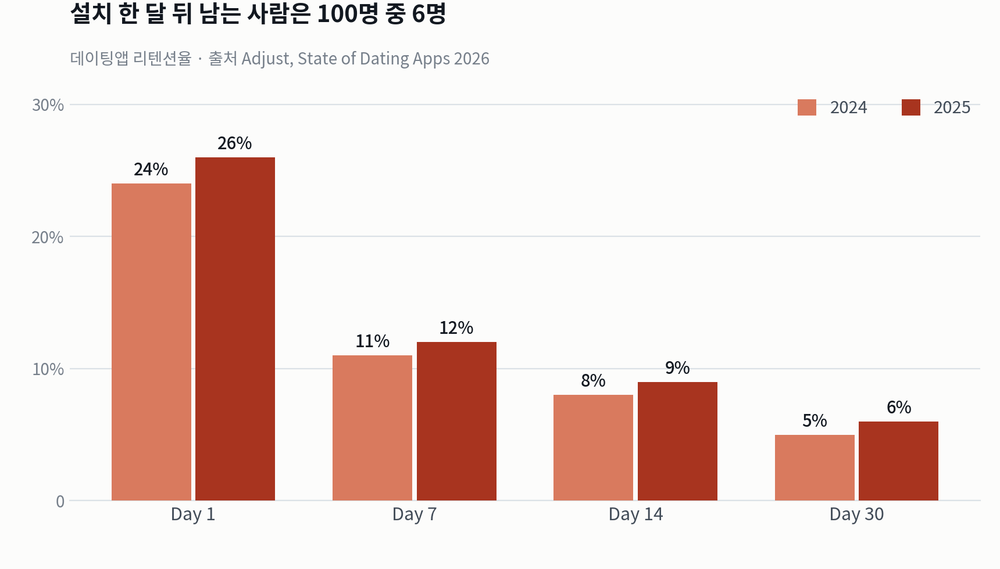
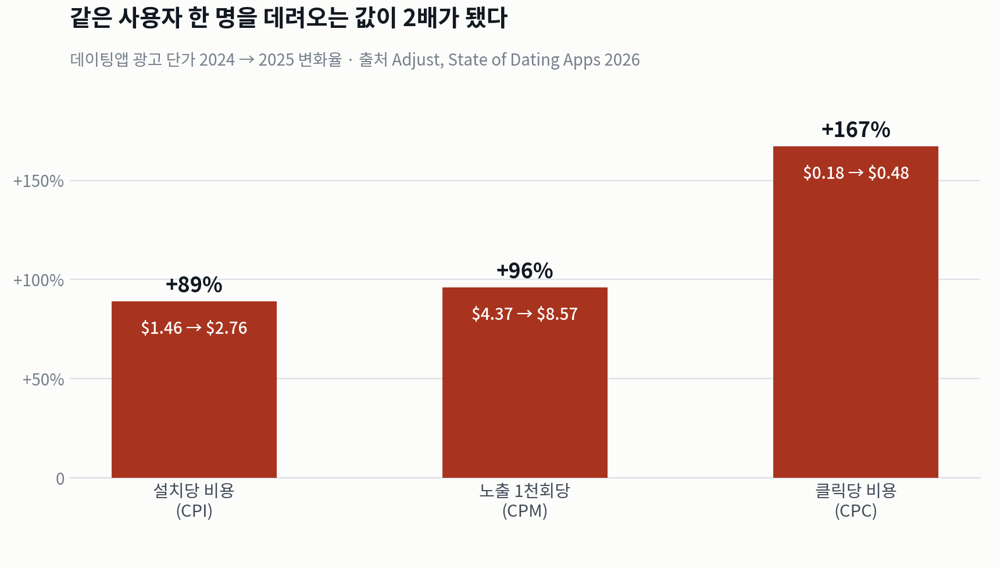
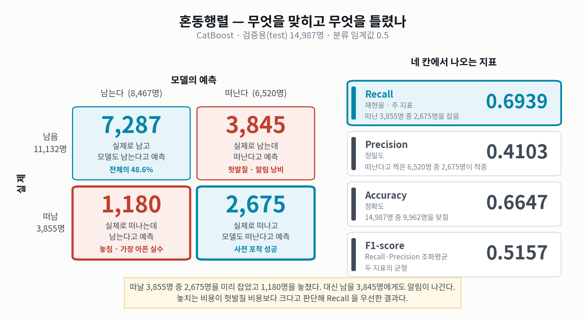
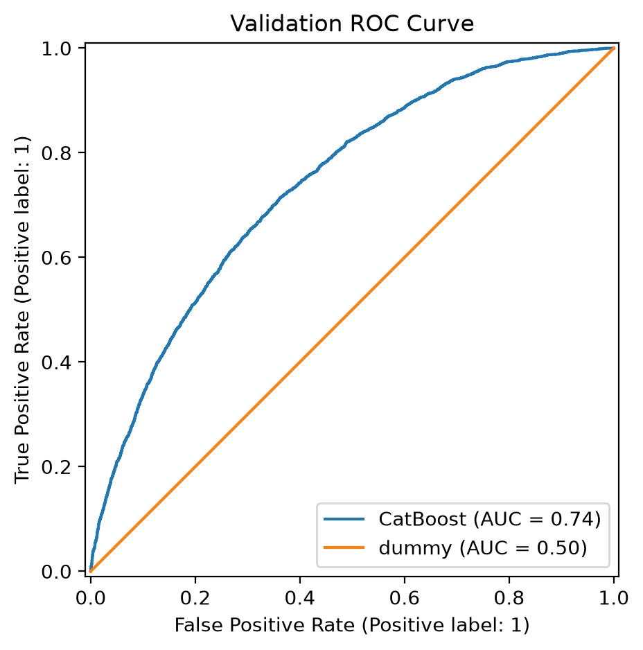
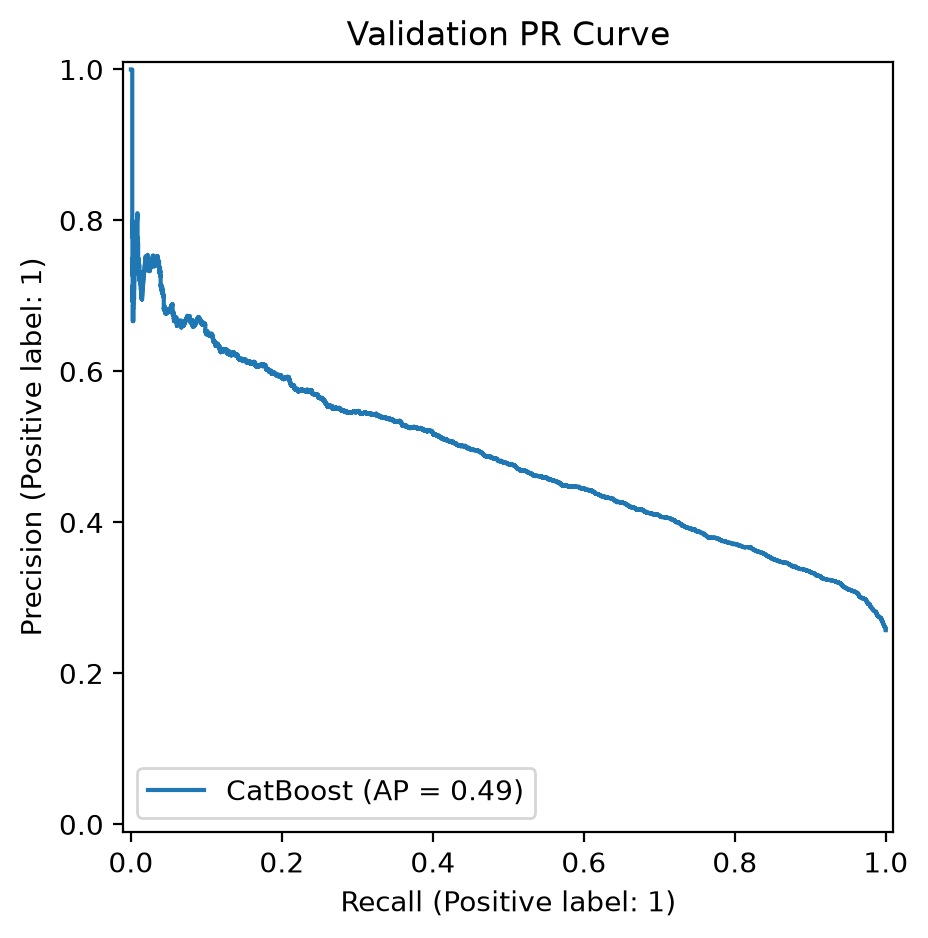
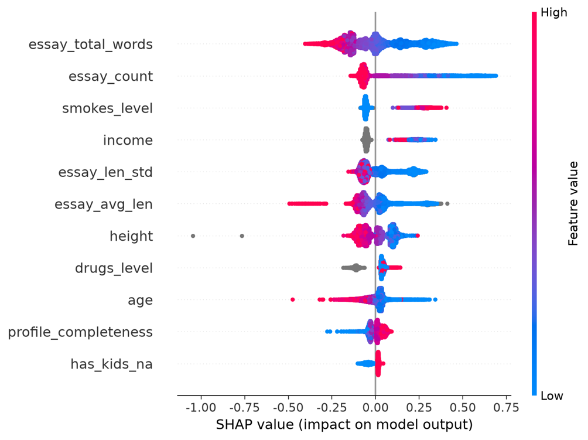
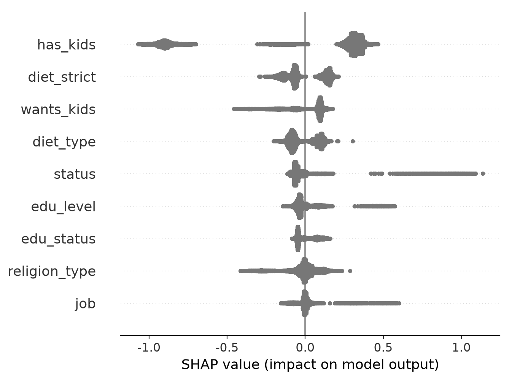
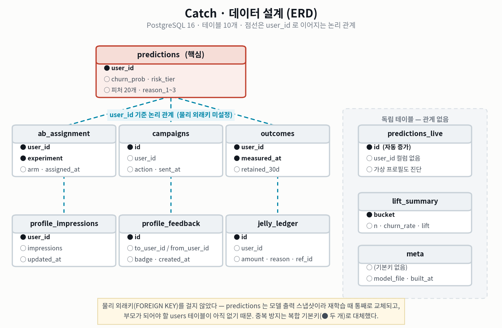
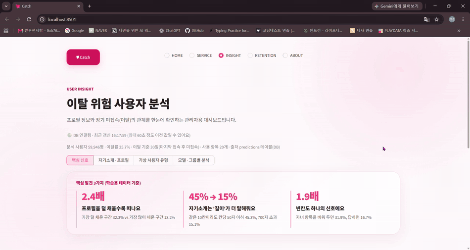
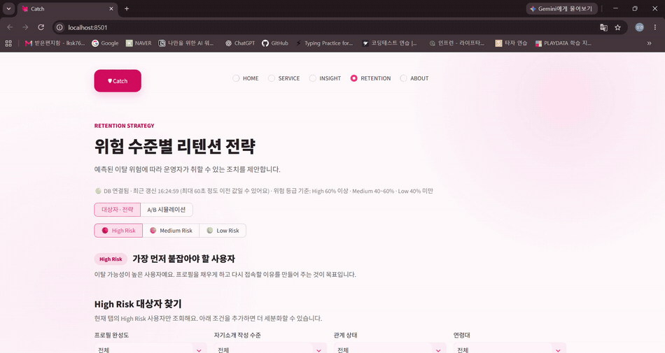

# SKN36-2nd-3Team

<div align="center">

# ♥ Catch

### 프로필 데이터 기반 데이팅앱 이탈 예측

장기 미접속 가능성을 분류하고, 한정된 관리 예산의 우선순위를 정하는 서비스


<br>


<sub>📽️ 프로필 입력 → 이탈 확률 진단 → 위험 근거 3개 확인 → 개선 시뮬레이션</sub>

</div>

---

<div align="center">

### 한눈에 보기

| 분석 대상 | 이탈 정의 | 모델 | 성능 | 핵심 결과 |
|:---:|:---:|:---:|:---:|:---:|
| **59,946명**<br>× 31개 컬럼 | 30일 미접속<br>**25.72%** | CatBoost<br>피처 20개 | ROC-AUC **0.740**<br>PR-AUC 0.485 | 위험 상위 20%에<br>이탈 의심자 **40.2%** 포함 |

</div>

---

## 📑 목차

| | 섹션 | 내용 |
|---|---|---|
| 1 | [팀 소개](#-1-팀-소개) | 팀원 · 역할 |
| 2 | [프로젝트 개요](#-2-프로젝트-개요) | 배경 · 목표 · 데이터셋 · 컬럼 선택 |
| 3 | [기술 스택](#-3-기술-스택) | 사용 기술 |
| 4 | [데이터 전처리 결과서 (EDA)](#-4-데이터-전처리-결과서-eda) | 가설 검증 · 결측치 · 파생변수 |
| 5 | [인공지능 학습 결과서](#-5-인공지능-학습-결과서) | 학습 순서 · 모델 비교 · 성능 · SHAP · **성능 개선 한계 점검** |
| 6 | [서비스 구현](#-6-서비스-구현) | 기능 · 개입 전략 · 아키텍처 · ERD |
| 7 | [결론](#-7-결론) | 한계점 · 개선 방안 |
| 8 | [한 줄 회고](#-8-한-줄-회고) | 팀원 회고 |
| 9 | [프로젝트 폴더 구조](#-9-프로젝트-폴더-구조) | 디렉터리 |

---

## 👥 1. 팀 소개

**SKN 36기 2차 프로젝트 3팀**

| 프로필 | 이름 | 담당 | GitHub |
|:---:|:---:|---|:---:|
|  | **강민지**<br><sub>팀장 · Frontend</sub> | Streamlit 화면 구현 · UI 설계 · README · GitHub 운영 · 발표자료 | mingverse |
|  | **임성경**<br><sub>데이터 · SQL</sub> | EDA · 전처리 · SQL / DB 구축 · 데이터 전처리 결과서 | lksk789 |
|  | **신지수**<br><sub>데이터 · EDA</sub> | EDA · 결과 해석 · 분석 코드 · SQL / DB 구축 · Feature 검토 | jisooschiro |
|  | **김재훈**<br><sub>모델링</sub> | 모델 학습 · 성능 비교 · 학습 결과서 · 서비스 시연 | iyuri2519 |

---

## 📌 2. 프로젝트 개요

### 프로젝트 명

> **💘 Catch** — OkCupid 데이팅앱 유저 데이터를 활용한 가입 고객 이탈 예측 (Churn Prediction)

### 프로젝트 소개

OkCupid는 미국의 온라인 데이팅 플랫폼으로, 본 프로젝트에서 활용한 데이터셋은 **2012년 북캘리포니아 지역 한정의 과거 공개 데이터**임. 접속·매칭·메시지 같은 **행동 로그 없이 프로필 정보만으로** 구성된 제한적인 데이터셋이며, 현재 서비스 및 국내 사용자와는 시점·지역 차이가 큼.

이러한 한계를 전제로, 본 프로젝트는 두 가지를 목표로 설정함. 첫째, 프로필 정보로 얻을 수 있는 예측력과 그 한계를 실험으로 확인하는 것. 둘째, 그 한계 안에서 실제로 운용 가능한 이탈 예측 · 리텐션 타깃팅 파이프라인을 설계·구현하는 것.

이탈 확률을 산출하는 데서 그치지 않음. 예측 결과를 PostgreSQL에 적재해 SQL로 개입 대상을 추출하고, 예산 규모별 효율까지 산출함. 이탈 확률 68%라는 숫자가 아니라 "오늘 이 456명에게 무엇을 보낼지"가 운영에 필요한 정보이기 때문임.

개발된 파이프라인은 다른 구독형 서비스의 고객 관리 문제에도 **구조를 응용**할 수 있으나, 데이터와 이탈 정의에 맞춘 **재학습·검증이 전제**되어야 함.

| 항목 | 내용 |
|---|---|
| 🗂 분석 대상 | OkCupid 프로필 **59,946명** × 31개 컬럼 |
| 🎯 이탈 정의 | 기준 시각(2012-07-01 09:00) 대비 **30일 이상 미접속** |
| 📦 결과물 | CatBoost 예측 모델 + PostgreSQL 16 + Streamlit 화면 |

```
[프로필 31개 항목] + [자기소개 10칸] + [최종 접속 기록]
                      │
            파생변수 20개 생성 · 이탈 라벨링
                      │
  CatBoost 학습 → 확률 예측 → 위험등급 분류 → 개입 대상 추출 · 근거 제시
```

---

### 📉 프로젝트 필요성 (배경)

데이팅앱은 **사용자가 남지 않는데 데려오는 비용은 오르는** 구조에 있음. 설치 30일 뒤 남는 사용자는 6% 수준이고, 같은 기간 설치당 광고비는 $1.46 → $2.76로 89% 올랐음.

<div align="center">

</div>

<sub>📊 <b>차트 읽는 법</b> — 설치 후 1일 / 7일 / 14일 / 30일에 남아 있는 사용자 비율. 막대는 2024년(연한 색)과 2025년(진한 색) 비교 · 원본: Adjust (2026)</sub>

<sub>📊 <b>차트 읽는 법</b> — 설치 후 1일 / 7일 / 14일 / 30일에 남아 있는 사용자 비율. 막대는 2024년(연한 색)과 2025년(진한 색) 비교 · 원본: Adjust (2026)</sub>

그래서 한정된 예산을 **누구에게 쓸지 고르는 문제**가 생김. 테스트셋에서 이탈 위험 상위 20%를 고르면 이탈 의심자의 **40.2%가 포함**됨 — 무작위 대비 **2.01배**. 이는 선별력이며 개입으로 이탈을 막은 효과는 측정하지 않음.

<details>
<summary><b>근거 수치 전체 보기</b> — 국내 MAU 감소 · 해외 리텐션 · 매치그룹 실적 · 광고비 2배 · 실질 유지 비용 · 출처 7건</summary>

<br>

#### 🇰🇷 국내 데이팅앱, 쓰는 사람이 줄고 있다

국내 데이팅앱 3사의 월간활성사용자(MAU)가 모두 감소했음.

| 앱 | 수치 | 출처 |
|---|---|---|
| 틴더 | 28만 1,200명 (2024.5) → **25만 9,000명** (2025.6) | 와이즈앱·리테일 (조선비즈 2025.07.08 인용) |
| 위피 | 15~16만명 (2022~2023) → **7만 3,000명** (2025.6) | 와이즈앱·리테일 (조선비즈 2025.07.08 인용) |
| 글램 | 12만 4,000명 → **11만 2,000명** (1년 사이) | 와이즈앱·리테일 (조선비즈 2025.07.08 인용) |
| 국내 데이팅앱 시장 규모 (2023) | 1,859억원 | Statista (머니투데이 2026.09.25 인용) |

**가입은 느는데 쓰는 사람은 준다**

| 위피 지표 | 2023 | 2024 | 최신 | 방향 |
|---|---:|---:|---:|:---:|
| 누적 가입자 | 665만명 | 748만명 | **820만명** (2026 Q1) | 🔺 **+23%** |
| 월간 사용자 (MAU) | 15~16만명 | — | **7만 3,000명** (2025.6) | 🔻 **-54%** |

> 누적 가입자는 23% 늘었지만 월간 사용자는 절반 이하로 줄었음. **신규 유입은 계속되는데 남지 않는다**는 뜻임.
>
> <sub>※ 누적 가입자(엔라이즈 자사 집계)와 MAU(와이즈앱·리테일 집계)는 기관·시점이 달라 직접 비교는 불가하나, 방향성의 차이는 뚜렷함</sub>

---


#### 🌍 해외 리텐션 상세

| 지표 | 수치 | 출처 |
|---|---|---|
| Day 1 리텐션 | 24% → 26% | Adjust (2026) |
| Day 7 리텐션 | 11% → 12% | Adjust (2026) |
| Day 14 리텐션 | 8% → 9% | Adjust (2026) |
| **Day 30 리텐션** | 5% → **6%** | Adjust (2026) |
| 12개월 이상 유지되는 유료 구독자 | **5% 미만** | Business of Apps (2026) |
| 전 세계 데이팅앱 월간 사용자 | 전년 대비 **10% 감소** | Sensor Tower (조선비즈 2025.07.08 인용) |

> 리텐션이 전년 대비 1%p 안팎 개선되긴 했으나 절대 수준 자체가 낮음.

---

---

#### 🏢 업계 1위 실적에도 나타난다

| 지표 (2026년 2분기) | 수치 | 출처 |
|---|---|---|
| 매치그룹 전체 유료 이용자 | 1,330만명 (**-6%**) | Match Group (2026) |
| 매치그룹 매출 | $853M (-1%) | Match Group (2026) |
| 틴더 유료 이용자 | 850만명 (-5%) | Match Group (2026) |
| 틴더 MAU | **-7%** | Match Group (2026) |

> 매출은 1% 줄었는데 유료 이용자는 6% 줄었음. 남은 사람에게 더 비싸게 받아 매출을 방어하고 있다는 뜻이며, 가격은 무한정 올릴 수 없음.

---

#### 📈 그런데 데려오는 비용은 2배가 됐다

사용자는 남지 않는데, 광고로 한 명을 데려오는 비용은 1년 만에 두 배가 됐음.

<div align="center">

</div>

<sub>📊 <b>차트 읽는 법</b> — 설치당·노출당·클릭당 광고 단가가 2024년 대비 2025년에 몇 % 올랐는지. 막대 안 숫자는 실제 금액 변화 · 원본: Adjust (2026)</sub>

| 지표 | 수치 | 출처 |
|---|---|---|
| 설치당 비용 (CPI) | $1.46 → **$2.76** (+89%) | Adjust (2026) |
| 노출 1천회당 비용 (CPM) | $4.37 → $8.57 (+96%) | Adjust (2026) |
| 클릭당 비용 (CPC) | $0.18 → $0.48 (+167%) | Adjust (2026) |
| 유료 : 자연 유입 비율 | 1.65 → **2.14** | Adjust (2026) |

> 광고를 보고 들어온 사용자 대비 저절로 들어온 사용자의 비율이 벌어졌다는 것은, 그만큼 광고를 더 사야 한다는 뜻임.

---

#### 💸 실제로 한 명 남기는 데 드는 비용

광고비는 설치 기준이므로, 30일 뒤까지 남는 사용자 1명당 비용은 광고비 ÷ 30일 잔존율로 구함.

| 연도 | 설치당 광고비 | 30일 잔존율 | 실질 비용 |
|---|---:|---:|---:|
| 2024 | $1.46 | 5% | 약 **$29** |
| 2025 | $2.76 | 6% | 약 **$46** |

1년 만에 약 58% 상승.

> ⚠️ 위 표는 Adjust·Business of Apps의 공개 수치를 바탕으로 본 프로젝트에서 직접 계산한 추정치이며, 원문에 제시된 값이 아님

---

#### 🎯 리텐션 예산의 딜레마 — 누구에게 쓸 것인가

| 지표 | 수치 | 출처 |
|---|---|---|
| 신규 획득 비용 : 기존 유지 비용 | **5 ~ 25배** | Harvard Business Review (2014) |

획득은 "얼마를 쓸 것인가"의 문제지만, 유지는 "누구에게 쓸 것인가"의 문제임.

| 집행 방식 | 한계 |
|---|---|
| 전체 사용자 대상 발송 | 사용자 수에 비례해 비용 증가. 감당 불가 |
| 무작위 선정 | 포착률이 표본 비율과 동일. 선별의 의미 없음 |
| 이탈 의사가 확정된 사용자 | 개입해도 복귀하지 않음. 예산만 소진 |
| 잔류가 확실한 사용자 | 개입 없이도 잔류. 리워드가 순수 비용 |

> **Catch는 이 선별 문제를 다룸.** 테스트셋에서 이탈 위험 상위 20%를 고르면 이탈 의심자의 **40.2%가 포함**됨 — 무작위 대비 2.01배. 이는 선별력이며 개입으로 이탈을 막은 효과는 측정하지 않음

---

#### 🏗️ 데이팅앱의 구조적 이탈 딜레마

일반 구독 서비스와 달리, 데이팅앱은 "매칭 성공 = 앱 이탈" 이라는 구조적 특수성을 가짐. 서비스가 잘 작동할수록 사용자가 떠나는 역설적 구조이기 때문에, 이탈 예측과 방지가 더욱 중요하고 어려움.

따라서 리텐션 전략은 이탈률 자체를 줄이는 것이 아니라 되돌릴 수 있는 이탈과 되돌릴 수 없는 이탈을 구분하는 데서 출발해야 함. 본 프로젝트에서도 연애 상태가 기혼·연애중인 565명은 이탈률 50.6%로 상위권이지만, 목적 달성형 이탈로 판단해 개입 대상에서 제외함.

---

#### 📚 Data Sources

> ⚠️ **차트 작성 방법** — 본 문서의 차트 2장은 아래 [1]의 수치를 바탕으로 본 프로젝트에서 직접 시각화한 그래프이며, 원본 이미지를 그대로 사용한 것이 아님

| # | 매체 | 자료 | 성격 | 링크 |
|:---:|---|---|---|:---:|
| 1 | **Adjust** (2026) | *Match made in data: The state of dating apps 2026* | 📊 업계 리포트 — 광고 단가 · 리텐션 | [바로가기](https://www.adjust.com/blog/state-of-dating-apps/) |
| 2 | **Business of Apps** (2026) | *Dating App Benchmarks* | 📊 업계 벤치마크 — 구독 유지율 | [바로가기](https://www.businessofapps.com/data/dating-app-benchmarks/) |
| 3 | **Match Group** (2026) | *Q2 2026 Earnings Release* | 💰 실적 발표 — 유료 이용자 · 매출 | [IR 원문](https://ir.matchgroup.com/financials/quarterly-results/) |
| 4 | **조선비즈** (2025.07.08) | 사랑 찾다 '번아웃'?… 성장 꺾인 '데이팅 앱' 틴더 韓 사용자 이탈 | 📰 뉴스 — 와이즈앱·리테일 · Sensor Tower 수치 인용 | [바로가기](https://v.daum.net/v/20250708154532385) |
| 5 | **머니투데이** (2026.09.25) | "결혼 언제 할래?" 잔소리에 긁힌 미혼남녀…방문 닫고 '이 앱' 열었다 | 📰 뉴스 — Statista 국내 시장 규모 · 엔라이즈 자사 데이터 인용 | [바로가기](https://www.mt.co.kr/future/2026/09/25/2026092217551412619) |
| 6 | Harvard Business Review (2014) | *The Value of Keeping the Right Customers* | 📖 이론 — 획득 : 유지 비용 비율 | [HBR 원문](https://hbr.org/2014/10/the-value-of-keeping-the-right-customers) |
| 7 | **Kaggle** | *OkCupid Profiles Dataset* | 🗂 원본 데이터 — 59,946명 × 31개 컬럼 | [바로가기](https://www.kaggle.com/datasets/andrewmvd/okcupid-profiles) |

---

</details>

---

### 🎯 프로젝트 목표

1. 프로필 데이터에서 이탈과 함께 나타나는 패턴 탐색
2. 이진 분류 모델로 이탈 고위험군 식별
3. 예측 결과를 SQL 타깃팅으로 연결해 관리 대상과 예상 포착 범위 산출
4. 현재 데이터에서 성능 개선이 제한된 지점을 실험으로 점검
5. 향후 캠페인 결과를 검증할 수 있는 A/B 실험 구조 제시

<details>
<summary><b>📌 평가 지표를 Recall 중심으로 잡은 이유</b> — 모델 선정은 PR-AUC, 서비스 임계값은 Recall</summary>

<br>

이 모델의 목적은 이탈 의심(장기 미접속) 가능성이 높은 사용자를 최대한 포착해 관리 우선순위를 정하는 것임. 실제 운영에서는 이를 선제 개입의 근거로 쓰는 것을 목표로 하지만, 미래 시점의 이탈 예측력은 현재 데이터로 검증하지 않았음.

| | |
|---|---|
| ⚖️ 비용 비교 | **False Negative**(이탈자를 잔류로 예측) > **False Positive**(잔류자를 이탈로 예측) |
| 💡 근거 | 이탈자를 놓치면 고객을 완전히 잃지만, 잘못 보낸 알림의 비용은 상대적으로 낮음 |
| ✅ 결론 | Precision을 일부 희생하더라도 **Recall을 높이는 방향**이 적합 |

단, Recall만 높이면 전원을 이탈로 예측해도 높은 수치가 나옴. ROC-AUC와 PR-AUC를 보조 지표로 함께 사용해 실질 판별력을 검증함.

> **지표를 쓰는 위치가 다름** — 모델·설정을 고를 때는 한쪽으로 치우치지 않는 `PR-AUC(AP)`로 비교하고, 고른 모델을 서비스에 붙일 때(임계값·위험등급 경계)는 `Recall`로 판단함. 학습 결과서의 비교표가 PR-AUC 기준인 이유임.

</details>

---

### 📂 데이터셋 기본 정보

| 항목 | 내용 |
|---|---|
| 출처 | Kaggle — [OkCupid Profiles](https://www.kaggle.com/datasets/andrewmvd/okcupid-profiles) |
| 규모 | **59,946건 × 31개 컬럼** |
| 수집 지역 | 미국 샌프란시스코 (북캘리포니아) |
| 수집 시기 | 2012년 6월 |
| 데이터 타입 | `int64` 2개 (age, income) / `float64` 1개 (height) / `object` **28개** |
| 중복 | 0건 |

> 31개 중 **28개가 문자열**인 범주형 중심 데이터셋. 이 특성이 모델 선택의 근거가 됨.

#### 🏷 이탈 라벨 정의

탈퇴 여부 컬럼이 없어 `last_online` 기준 **30일 이상 미접속**을 이탈 의심으로 정의함 (**15,419명 · 25.72%**). 기준일 6가지를 비교해 선택함.

<details>
<summary><b>기준일 6가지 비교와 선택 근거</b></summary>

<br>

데이터셋에 탈퇴 여부 컬럼이 없어 `last_online`으로 이탈을 정의해야 했음. 기준일을 6가지로 나눠 비교한 뒤 선택함.

| 미접속 기준 | 이탈 인원 | 비율 | |
|---|---:|---:|---|
| 7일 | 24,277명 | 40.5% | 바쁜 한 주도 이탈로 분류 |
| 14일 | 19,604명 | 32.7% | |
| **30일** | **15,419명** | **25.72%** | ✅ **채택** |
| 60일 | 11,752명 | 19.6% | |
| 90일 | 9,245명 | 15.4% | 개입 시점 경과 |
| 180일 | 4,788명 | 8.0% | 양성 비율 과소 |

**30일 선택 근거**

- 7일·14일은 바쁜 한 주를 보낸 사용자까지 이탈로 분류함
- 90일 이상은 개입 시점이 이미 지난 상태
- 30일은 업계 표준 MAU 기준이며, 양성 비율 25.7%로 학습에도 적절

> ⚠️ 이 값은 **탈퇴가 아닌 이탈 의심**임. 문서·화면 전반에 그렇게 표기함.

</details>

---

### 🗃 데이터 선택

원본 **31개 컬럼** 중 직접 피처 12 · 완성도 계산용 5 · 라벨 생성용 1 · 미사용 4.

<details>
<summary><b>컬럼별 사용 여부와 제외 사유 전체 보기</b></summary>

<br>

원본 31개 컬럼의 사용 여부와 제외 사유.

| 컬럼 | 사용 | 처리 / 제외 사유 |
|---|:---:|---|
| `age` | ✅ | 그대로 사용 (18~90 밖 2행 결측 처리) |
| `status` | ✅ | 연애 상태. 이탈률 59.3% ~ 24.6% |
| `height` | ✅ | 이상치 73행 결측 처리 |
| `income` | ✅ | `-1`(미공개) → 결측 처리. **미공개 여부 자체가 신호** |
| `job` | ✅ | 범주 그대로 사용 |
| `education` | ✅ | → `edu_level`, `edu_status` |
| `religion` | ✅ | → `religion_type` (종교 계열만 추출) |
| `diet` | ✅ | → `diet_type`, `diet_strict` |
| `drugs` | ✅ | → `drugs_level` (never 0 / sometimes 1 / often 2) |
| `smokes` | ✅ | → `smokes_level` (0~4 순서 인코딩) |
| `offspring` | ✅ | → `has_kids`, `wants_kids`, `has_kids_na` |
| `essay0`~`essay9` | ✅ | → `essay_count`, `essay_total_words`, `essay_avg_len`, `essay_len_std` |
| `body_type` | 🔵 | 직접 피처 아님. 프로필 완성도 계산에 사용 |
| `drinks` | 🔵 | 동일 |
| `pets` | 🔵 | 동일 |
| `ethnicity` | 🔵 | 동일 (민감 정보로 직접 피처 미사용) |
| `sign` | 🔵 | 동일 |
| `last_online` | 🎯 | 이탈 라벨 생성용. 생성 직후 삭제 |
| `location` | ❌ | 캘리포니아 **99.8%**, 샌프란시스코 51.8%. 변별력 없음 |
| `speaks` | ❌ | 자유 서술 + 다중값. 정제 비용 대비 신호 불확실 |
| `sex` | ❌ | 이탈률 남 **25.3%** / 여 **26.3%** 로 차이 미미 |
| `orientation` | ❌ | 집단 간 이탈률 차이 미미 |

<sub>✅ 직접 피처 · 🔵 완성도 계산에만 사용 · 🎯 라벨 생성 후 삭제 · ❌ 미사용</sub>

</details>

---

## 🛠 3. 기술 스택

| 구분 | 기술 |
|---|---|
| **Frontend** |   |
| **ML** |    |
| **Backend** |    |
| **Database** |   |
| **Environment** |   |
| **협업** |    |

---

<details>
<summary><b>▶ 실행 안내</b> — uv · Docker · Streamlit 실행 순서와 주의사항</summary>

<br>

프로젝트 루트에서 Python, [uv](https://docs.astral.sh/uv/), Docker를 준비한 뒤 실행함.

```bash
uv sync
cd sqlonly
docker compose up -d
cd ..
uv run streamlit run ui/app.py
```

| ⚠️ | 주의 |
|:---:|---|
| 모델 파일 | `models/`는 Git에서 제외됨. **개별 진단(SERVICE)** 화면을 쓰려면 학습된 `.cbm` 파일이 로컬에 있어야 함 |
| DB 갱신 | `sql/init/`은 **컨테이너 최초 생성 시에만** 실행됨. 최신 데이터를 반영하려면 `docker compose down -v` 후 재기동 (기존 데이터는 삭제됨) |

환경변수 이름과 기본값은 [`sqlonly/README.md`](sqlonly/README.md) · [`sqlonly/docker-compose.yml`](sqlonly/docker-compose.yml) · [`.env.example`](.env.example) 참고.

</details>

---

## 🔍 4. 데이터 전처리 결과서 (EDA)

> 모든 수치는 **검증용(test) 14,987명** 기준. 전체 평균 이탈률 25.7%.
>
> <sub>※ 등급·확률 관련 수치는 저장소의 <code>sqlonly/sql/init/predictions.csv</code>(팀 공용 예측 결과)로 산출했으며, 서비스 화면에 표시되는 값과 동일함</sub>

### ① 무엇을 확인했나 — 가설 검증

| 가설 | 해당 인원 | 해당 집단 | 반대 집단 | 배수 |
|---|---:|---:|---:|---:|
| **H1-1** 자기소개 0칸 | 518명 | **58.9%** | 24.5% | 🔥 **2.40** |
| **H2** 비적극 (연애중·기혼) | 565명 | **50.6%** | 24.7% | 🔥 **2.05** |
| **H1-4** 프로필 완성도 하위 | 1,809명 | 35.4% | 24.4% | 1.45 |
| **H3** 소득 공개 | 2,895명 | 30.2% | 24.6% | 1.23 |

<details>
<summary><b>항목별 상세 — 자기소개 · 완성도 · 연애 상태 · 신호가 약했던 항목 · 재현 검사</b></summary>

<br>

**📝 자기소개 칸 수별 이탈률**

| 작성 칸 수 | 이탈률 | |
|---:|---:|---|
| **0칸** | **58.9%** | ████████████ |
| 1칸 | 44.1% | █████████ |
| 2칸 | 37.9% | ███████ |
| 3칸 | 34.0% | ███████ |
| 6칸 | 29.1% | ██████ |
| **10칸** | **22.0%** | ████ |

앞쪽 구간의 기울기가 뒤쪽보다 훨씬 가파름 — `0칸 → 3칸` **24.9%p** 하락 vs `6칸 → 10칸` **7.1%p** 하락.

> 완벽한 프로필을 요구하는 것보다 **아무것도 쓰지 않은 사용자가 첫 몇 칸을 쓰게** 만드는 쪽이 효율적. 개입 그룹 A~D 설계의 근거.

**📊 프로필 완성도 (17개 항목 중 응답 비율)**

| 완성도 구간 | 인원 | 이탈률 |
|---|---:|---:|
| 하위 | 1,809명 | **35.4%** |
| | 3,897명 | 28.5% |
| | 4,046명 | 28.0% |
| | 4,571명 | 19.7% |
| 상위 | 664명 | **10.5%** |

> 거의 안 채운 집단과 다 채운 집단의 차이 **3.4배**. 결측치를 채우지 않기로 한 판단의 근거.

**💑 연애 상태**

| status | 인원 | 이탈률 |
|---|---:|---:|
| married | 59명 | **59.3%** |
| seeing someone | 506명 | **49.6%** |
| available | 517명 | 30.0% |
| single | 13,903명 | 24.6% |

> 이미 상대가 있는 사용자는 앱을 쓸 이유가 사라짐. **되돌릴 수 없는 이탈**로 보고 개입 대상에서 제외.

**🔇 신호가 약했던 항목**

| 항목 | 결과 | 조치 |
|---|---|---|
| 연령대 | 18~24세 29.1% → 45세 이상 23.7% (5.4%p) | 유지, 비중 낮음 |
| 성별 | 남 25.3% / 여 26.3% (1.0%p) | ❌ 제외 |
| 지역 | 캘리포니아 99.8% | ❌ 제외 |

**🔁 재현 검사** — 표본을 바꿔도 같은 결과가 나오는지 확인

| split | 집단 | 인원 | 이탈률 |
|---|---|---:|---:|
| train | 자기소개 0칸 | 1,616명 | **58.2%** |
| test | 자기소개 0칸 | 518명 | **58.9%** |

> 차이 **0.7%p**. 서로 다른 표본에서 같은 값이 나옴.

</details>

---

### ② 어떻게 정제했나 — 빈칸을 채우지 않고 신호로 남김

| 유형 | 처리 |
|---|---|
| 글자 항목 | `not_disclosed`로 통일 |
| 숫자 항목 | 빈칸 유지. CatBoost가 결측을 직접 학습 |
| 결측 행 | **삭제하지 않음** |

근거는 위 완성도 표. 거의 안 채운 집단 **35.4%** vs 다 채운 집단 **10.5%** — 평균값으로 메우면 이 **3.4배 격차가 사라짐.**

직업란의 "말하고 싶지 않음"은 그대로 유지함. **체형란의 무응답과 이탈 방향이 반대**로 나타나 항목별로 무응답의 의미가 다르다고 판단함.

<details>
<summary><b>정제 내역 · 데이터 누수 차단 4단계</b></summary>

<br>

**🧹 정제 내역**

| 항목 | 처리 |
|---|---|
| HTML 특수문자 | 자기소개 **36,111칸**의 `&amp;`, `<br />` 등 복원 |
| 키 이상치 | 73행 결측 처리 |
| 나이 범위 밖 | 2행 결측 처리 |
| 소득 미공개 | `-1` → 결측 처리 |
| 중복 | 0건 |

**🔒 데이터 누수 차단**

| 단계 | 조치 |
|:---:|---|
| 1️⃣ | 라벨 생성 **직후** `last_online` 삭제 |
| 2️⃣ | 파생변수 생성을 train / test에서 **독립 수행** |
| 3️⃣ | 구간(bin) 경계를 **train에서만** 산출해 test에 적용 |
| 4️⃣ | 임계값 탐색을 **내부 검증셋**에서만 수행 |

> `last_online`을 남기면 모델이 정답을 그대로 참조함. 성능은 높게 나오지만 실제 예측력은 없음.

</details>

---

### ③ 최종 결과 — 피처 20개

| 그룹 | 변수 |
|---|---|
| 📝 자기소개 (4) | `essay_count`, `essay_total_words`, `essay_avg_len`, `essay_len_std` |
| 📊 프로필 충실도 (1) | `profile_completeness` |
| 👤 인적 사항 (5) | `age`, `height`, `income`, `job`, `status` |
| 🎓 학력·종교 (3) | `edu_level`, `edu_status`, `religion_type` |
| 👶 자녀 (3) | `has_kids`, `wants_kids`, `has_kids_na` |
| 🍺 생활 습관 (4) | `diet_type`, `diet_strict`, `smokes_level`, `drugs_level` |
| 🎯 **타깃** | `churn` — 이탈(1) / 잔류(0) |

> 구현은 `common/feature_extraction.py`. **학습과 예측이 같은 코드를 공유**함.
> 이 20개는 **25개에서 5개를 제거한 결과**임 — 축소 근거는 [학습 진행 순서](#-학습-진행-순서) 참고.

<details>
<summary><b>파생변수 정의와 채택 절차</b></summary>

<br>

| 변수 | 내용 |
|---|---|
| `essay_count` | 자기소개 10칸 중 작성한 칸 수 |
| `essay_total_words` | 전체 단어 수 |
| `essay_avg_len` | 한 칸당 평균 길이 |
| `essay_len_std` | 칸별 길이 편차 |
| `profile_completeness` | 프로필 17개 항목 중 응답 비율 |

> `essay_count`와 `essay_total_words`의 **상관계수는 약 0.46**으로 중간 정도의 관계임. 여러 칸을 짧게 쓰는 사용자와 한두 칸을 길게 쓰는 사용자를 구분하기 위해 둘 다 유지하고, `essay_avg_len`·`essay_len_std`로 작성 패턴을 보완함.

**채택 절차**

```
① 집단별 이탈률 차이 확인
② 해당 인원 수 확인 (인원이 적으면 우연 가능)
③ 다른 변수의 영향 제거 후에도 차이가 남는지 확인
④ 해당 변수를 빼고 재학습해 성능 변화 측정
```

</details>

---

## 🤖 5. 인공지능 학습 결과서

### 🧭 학습 진행 순서

세 단계를 거쳐 좁혀 나감.

| 단계 | 변수 | 한 일 | 결과 |
|:---:|:---:|---|---|
| **1️⃣ Baseline** | 14개 | 파생변수 없이 기준선 확보 | Recall 0.698 · Precision 0.386 · ROC-AUC 0.723 |
| **2️⃣ 모델 비교** | 25개 | 6개 모델 동일 조건 비교 | CatBoost 선정 |
| **3️⃣ 변수 축소** | **20개** | 기여가 겹치는 5개 제거 | 성능 유지 · 구조 단순화 |

**제거한 5개** — `actively_looking` · `has_essay0` · `profile_completeness_group` · `essay_almost_empty` · `essay_has_link`

| | 25개 | 20개 | 차이 |
|---|---:|---:|---:|
| ROC-AUC | 0.73673 | 0.73664 | −0.00009 |
| PR-AUC | 0.48815 | 0.48784 | −0.00031 |
| F1 | 0.50979 | 0.51135 | **+0.00156** |

감소폭이 소수점 넷째 자리에 그치고 F1은 오히려 올라, 같은 성능이면 **변수가 적은 쪽**을 택함.

<sub>※ 이 비교는 <b>동일한 hyperparameter로 3-Fold 교차검증</b>을 돌린 결과이며, 아래 「성능」 표의 Test 수치와는 다른 절차임</sub>

---

### ⚖️ 모델 비교

6개 모델을 같은 데이터·같은 분할·같은 평가 조건으로 비교한 뒤 CatBoost를 채택함. (위 2️⃣ 단계 — 변수 25개 시점의 비교임)

| 모델 | 계열 | Accuracy | Precision | Recall | F1 | ROC-AUC | |
|---|---|---:|---:|---:|---:|---:|---|
| LogisticRegression | 선형 | 0.65350 | 0.39961 | 0.69079 | 0.50632 | 0.72869 | 오탐 많음 |
| RandomForest | 배깅 | 0.71749 | 0.45748 | 0.52892 | 0.49062 | 0.73108 | Recall 낮음 |
| XGBoost | 부스팅 | 0.67225 | 0.41602 | 0.67912 | 0.51596 | 0.74095 | CatBoost와 근접 |
| LightGBM | 부스팅 | 0.66818 | 0.41249 | 0.68353 | 0.51450 | 0.73965 | XGBoost와 유사 |
| **CatBoost** | 부스팅 | 0.66838 | 0.41424 | **0.69857** | **0.52008** | **0.74146** | ✅ 채택 |
| MLP | 신경망 | **0.75746** | **0.58634** | 0.19377 | 0.29128 | 0.73028 | ⚠️ 아래 참고 |

**MLP가 Accuracy를 주 지표로 쓰면 안 되는 이유를 보여줌.** Accuracy 0.757로 가장 높지만 Recall이 0.194 — 이탈자 100명 중 19명만 잡아냅니다. 대다수인 '유지'를 찍어서 얻은 정확도임.

CatBoost는 Recall·F1·ROC-AUC에서 가장 높았으나 **XGBoost·LightGBM과의 차이가 0.002 안팎**이라, 성능만으로 고른 것이 아니라 아래 세 가지를 함께 고려함.

<details>
<summary><b>CatBoost를 고른 세 가지 이유</b></summary>

<br>

**CatBoost 채택 근거**

| | 근거 | 내용 |
|:---:|---|---|
| 🏷 | 범주형 비중 | 최종 20개 중 **9개가 범주형**. 직업·학력·식단 등을 별도 인코딩 없이 직접 처리 |
| 🕳 | 결측 처리 | 수치형 결측을 따로 채우지 않아도 학습 가능. "무응답이 신호"라는 전제와 일치 |
| 💬 | 설명 가능성 | 내장 SHAP으로 사용자별 **위험 근거 3개** 산출 |

</details>

### ⚙️ 학습 설정

| 항목 | 값 |
|---|---|
| 데이터 분할 | Train **44,959** / Test **14,987** (층화 분할, seed 42) |
| 하이퍼파라미터 | `iterations=300`, `depth=5`, `learning_rate=0.06` |
| 클래스 불균형 | `auto_class_weights="Balanced"` |
| 평가 | 5-Fold 교차검증(`shuffle=True`, `random_state=42`) + 홀드아웃 Test |

### 📈 성능

| 지표 | 5-Fold 교차검증 | Test |
|---|---|---|
| **ROC-AUC** | 0.73689 ± 0.00374 | **0.74005** |
| PR-AUC | 0.48980 ± 0.00536 | 0.48525 |
| **Recall** | 0.68411 ± 0.00628 | **0.69390** |
| Precision | 0.40733 ± 0.00438 | 0.41028 |
| F1 | 0.51060 ± 0.00294 | 0.51566 |
| Accuracy | — | 0.66471 |

무작위 예측 시 ROC-AUC는 0.5. 5-Fold 편차 0.004로 표본을 바꿔도 결과가 안정적임. **과적합 점검** — Train Accuracy 0.67206 vs Test 0.66471로 차이는 0.00735였으나, 이 차이만으로 과적합 여부를 단정할 수는 없음.

<sub>※ 위 「모델 비교」의 CatBoost 수치(ROC-AUC 0.74146)와 미세하게 다름 — 모델 선정용 비교와 최종 학습이 서로 다른 실행이기 때문. <b>최종 성능은 이 표 기준</b></sub>

> 테스트셋의 이탈 의심 **3,855명 중 2,675명(69.4%)을 양성으로 분류**함(Recall 0.694). **양성으로 분류한 전체 사용자**(임계값 0.5 이상, 6,520명) 중 실제 이탈자는 41%(Precision 0.410)였음. 의도한 트레이드오프이며, 예산 규모에 따라 등급 경계를 조정할 수 있도록 설계함.
>
> <sub>※ 이 41%는 <b>임계값 0.5 기준 양성 전체</b>의 값이며, High 등급(0.60 이상)의 실제 이탈률 <b>49.0%</b>와는 다른 지표임 — 「위험등급 기준과 실제 이탈률」 참고</sub>

<details>
<summary><b>혼동행렬 · ROC / PR 곡선 보기</b></summary>

<br>

<div align="center">

</div>

<div align="center">


</div>

<sub>ROC 곡선(AUC 0.74)과 PR 곡선(AP 0.49). 이탈 의심 비율이 25.7%이므로 무작위 예측의 AP는 약 0.26임 — 그보다 높다는 것은 양성을 앞쪽에 배치하는 능력이 있다는 뜻</sub>

</details>

### 🔬 모델 해석 — Global SHAP TOP 5

| 순위 | 변수 | 평균 절대 SHAP |
|:---:|---|---:|
| 1 | 자녀 유무 (`has_kids`) | **0.467** |
| 2 | 자기소개 총 단어 수 (`essay_total_words`) | 0.149 |
| 3 | 식단 엄격도 (`diet_strict`) | 0.114 |
| 4 | 자기소개 작성 개수 (`essay_count`) | 0.114 |
| 5 | 자녀 희망 여부 (`wants_kids`) | 0.101 |

1위가 2위의 3배 이상이지만 해석에 주의가 필요함. `has_kids`는 결측률이 약 59% 로, "자녀가 있어서 이탈한다"가 아니라 프로필 응답 성향을 대리하는 신호로 보는 것이 타당함.

SHAP은 예측에 기여한 정도를 보여줄 뿐 이탈의 원인을 증명하는 값이 아님. 화면(SERVICE)에서는 사용자 한 명마다 Local SHAP을 다시 계산해 개인별 위험 근거 3개를 제시함.

<details>
<summary><b>SHAP 분포 그림 보기 — 수치형 11개 · 범주형 9개</b></summary>

<br>

**수치형 11개**

<div align="center">

</div>

<sub>가로축은 이탈 확률에 준 영향(오른쪽일수록 위험↑), 점 색은 그 사용자의 실제 값(🔴 높음 / 🔵 낮음 / ⚪ 결측). 자기소개 4개 변수 모두 <b>파랑(적게 씀)이 오른쪽</b>에 모여 "덜 쓸수록 위험"이 그대로 보임. 소득은 <b>결측(회색)이 왼쪽, 공개한 값이 오른쪽</b>으로, 가설 H3(소득 공개 30.2% vs 미공개 24.6%)과 방향이 같음</sub>

**범주형 9개**

<div align="center">

</div>

<sub><b>점이 모두 회색인 이유</b> — 범주형은 <code>yes</code>·<code>no</code>·<code>not_disclosed</code>처럼 크고 작음이 없어 값의 크기를 색으로 칠할 수 없음. 따라서 <b>이 그림으로는 "어떤 응답이 위험한지" 읽을 수 없고</b>, 방향은 값별 집계로 따로 확인해야 함. 읽을 수 있는 것은 영향의 <b>크기와 퍼짐</b>뿐임 — <code>has_kids</code>가 압도적이고 <code>status</code>는 오른쪽 꼬리가 긺</sub>

<sub>※ 두 그림은 학습 노트북에서 산출한 원본이며, 그림의 세로 정렬은 평균 |SHAP| 순서와 일부 다를 수 있음 (그림은 수치형·범주형을 따로 그린 것)</sub>

</details>

> ⚠️ **민감 정보는 개입 기준으로 직접 쓰지 않음** — `has_kids`·`wants_kids`·`religion_type`은 SHAP 기여도가 높지만, 자녀 계획이나 종교를 근거로 사용자를 분류해 캠페인을 보내는 것은 적절하지 않다고 판단함. 이들은 예측 내부 신호로만 쓰고, 실제 개입 대상은 `status`(연애 상태)와 프로필·자기소개 충실도 같은 서비스 이용 행태 기준으로 나눔 — 「개입 대상 분류」 참고.

#### 🔄 집계와 모델이 반대로 말하는 구간 — 프로필 완성도

<details>
<summary>집계로는 <b>완성도가 높을수록 덜 떠나는데</b>, 조건을 고정하면 반대로 나옴 — <b>자세히 보기</b></summary>

<br>

`profile_completeness`는 집계와 모델 내부의 방향이 서로 반대임. 처음에는 오류로 의심했으나 확인 결과 둘 다 맞았음.

**① 집계로 보면 — 완성도가 높을수록 덜 떠남**

| 프로필 응답률 | 인원 | 실제 이탈률 |
|---|---:|---:|
| ~50% | 7,583 | **35.54%** |
| 50~70% | 15,343 | 28.65% |
| 70~85% | 22,917 | 25.52% |
| 85~95% | 11,385 | 19.07% |
| 95~100% | 2,718 | **11.37%** |

<sub>※ 이 표는 <b>전체 데이터 59,946명 기준</b>임 (4장 머리의 "모든 수치는 test 기준"과 다름). 조건별 표본을 확보하기 위해 전체를 사용함</sub>

**② 조건을 고정하면 — 완성도가 높을수록 더 떠남**

`has_kids` 무응답 · 자기소개 10칸 · `diet_strict` 무응답으로 조건을 맞춘 8,025명만 놓고 완성도만 변화시킨 결과.

| 프로필 완성도 | 인원 | 모델 예측 확률 | 실제 이탈률 |
|---|---:|---:|---:|
| ~60% | 3,726 | 54.6% | 31.2% |
| 60~75% | 2,899 | 55.9% | 34.1% |
| 75~85% | 1,400 | **58.6%** | **34.8%** |

같은 방식으로 자녀·식단·자기소개를 통제한 38개 층 58,013명으로 확대해도 결과가 유지됨.

| | corr(완성도, 예측확률) |
|---|---:|
| 통제 없음 | **−0.4193** |
| 조건 통제 후 | **+0.0541** (27개 층 양수 / 11개 음수) |

<sub>※ 이 확대 분석(58,013명)도 <b>전체 데이터 기준</b>이라 <b>학습에 쓴 train 데이터가 포함</b>되어 있음. 모델이 정답을 본 구간이 섞여 있으므로 방향을 보는 참고 자료로만 사용함</sub>

**③ 그림으로도 보임**

위 「모델 해석」의 수치형 SHAP 그림에서 `profile_completeness` 행을 보면, **🔴 빨강(완성도 높음)이 오른쪽(위험↑)** 에, 🔵 파랑(낮음)이 왼쪽에 몰려 있음. 집계 표(①)와 정반대 방향임.

**④ 왜 부호가 뒤집히는 것으로 보이나**

`has_kids` · `diet_strict` · `wants_kids` · `essay_*` 가 "응답하는 성향"과 겹치는 정보를 이미 상당 부분 담고 있음. **다른 변수와 정보가 겹치면서 `profile_completeness`의 조건부 기여 방향이 달라졌을 가능성**이 있음 (통계에서 억제변수 효과로 불리는 현상과 유사함).

예를 들어 나머지 항목은 채웠는데 자녀 항목만 비워둔 사용자가 여기에 해당할 수 있음. 다만 **현재 표만으로 그 원인을 확정할 수는 없고**, 항목별 응답 패턴을 따로 분석해야 확인 가능함.

| 질문 | 관찰 | 근거 |
|---|---|---|
| 완성도 높은 **집단**이 덜 떠나는가 | **그렇다** | 35.54% → 11.37% |
| 조건이 같을 때 완성도가 높으면 덜 떠나는가 | **아니다** | 54.6% → 58.6% |

**서로 다른 질문이므로 답이 반대로 나오는 것이 이상한 일은 아님.** 서비스 화면에서 위험 근거를 보여줄 때는 ②(조건부 기여)를, 대상 집단을 나눌 때는 ①(집계)을 기준으로 사용함.

<sub>※ 이 현상 때문에 `profile_completeness`는 개별 사용자의 위험 근거 TOP3에 거의 등장하지 않음(179,838개 슬롯 중 49건, 0.03%). 다른 변수들이 같은 정보를 먼저 설명하기 때문</sub>

</details>

---

### 📐 성능 개선 한계 점검

ROC-AUC 0.74에서 성능이 멈춘 원인을 **세 방향으로 나눠 각각 실험**함.

| 의심 | 실험 | 결과 |
|---|---|---|
| 1️⃣ 데이터가 부족한가 | 학습량 10% → 100% 학습곡선 | 증가폭 **0.0085 → 0.0008** 로 10분의 1 |
| 2️⃣ 모델이 약한가 | 선형 · 배깅 · 부스팅 3계열 비교 | PR-AUC **0.46~0.49** 안에 모임 (차이 0.023) |
| 3️⃣ 설정이 잘못됐나 | depth 2 ~ 9 극단 비교 | **복잡하게 만든 쪽이 오히려 낮음** |

<details>
<summary><b>실험별 상세 수치 보기</b></summary>

<br>

**1️⃣ 학습곡선** — 학습 데이터를 10%에서 100%까지 늘려가며 측정

| 학습량 | 인원 | PR-AUC | 증가폭 | ROC-AUC |
|---|---:|---:|---:|---:|
| 10% | 4,495명 | 0.4688 | — | 0.7258 |
| 25% | 11,239명 | 0.4748 | +0.0060 | 0.7320 |
| 50% | 22,479명 | 0.4833 | **+0.0085** | 0.7375 |
| 75% | 33,719명 | 0.4855 | +0.0022 | 0.7395 |
| **100%** | **44,959명** | **0.4863** | **+0.0008** | **0.7404** |

50%에서 100%로 2배 늘려도 PR-AUC는 0.003 오르는 데 그침.

**2️⃣ 계열 비교** — 선형 · 배깅 · 부스팅을 동일 조건으로 재현

| 모델 | 계열 | PR-AUC | ROC-AUC |
|---|---|---:|---:|
| LogisticRegression | 선형 | 0.4619 | 0.7223 |
| RandomForest | 배깅 | 0.4743 | 0.7320 |
| CatBoost | 부스팅 | 0.4849 | 0.7400 |

<sub>※ 추가 비교를 위해 별도 실행한 재현 실험이며, 위 「모델 비교」의 6개 모델 평가와는 다른 실행임</sub>

**3️⃣ 극단 비교** — 설정을 단순·복잡 양쪽으로 밀어봄

| 설정 | PR-AUC | ROC-AUC |
|---|---:|---:|
| depth 2 · iterations 100 (단순) | 0.4639 | 0.7264 |
| depth 5 · iterations 300 (채택) | **0.4849** | **0.7400** |
| depth 9 · iterations 900 (복잡) | 0.4836 | 0.7363 |

</details>

#### 🧩 결론

세 방향 모두 같은 지점에서 수렴함. 현재 데이터는 프로필이라는 **정적 정보뿐**이고, 로그인·메시지·매칭 같은 행동 데이터가 없음. 사용자가 떠날 때 먼저 변하는 것은 프로필이 아니라 행동인데 그 신호를 볼 수 없는 상태임.

> **현재 데이터와 실험 범위에서는** 튜닝만으로 뚜렷한 개선이 확인되지 않았음. 행동 로그가 추가되면 달라질 수 있으며, 프로필만으로 가능한 성능의 절대적인 상한을 증명한 것은 아님.

---

### 🧪 검증 후 기각한 후보

하이퍼파라미터 자동 탐색 26회를 포함해 **11개 후보를 검증하고 근거가 부족한 것은 채택하지 않음.**

<details>
<summary><b>기각 항목 전체 보기</b> — HPO 26회 · 데이터 누수 · SMOTE · 임계값 조정 등</summary>

<br>

성능 향상 가능성이 있는 후보를 차례로 검증하고, 근거가 부족한 것은 채택하지 않음.

#### 🔧 하이퍼파라미터 자동 탐색

Optuna로 Random Search 12회 + Bayesian Search 14회, 총 26회 탐색.

| 설정 | 5-Fold PR-AUC | 5-Fold ROC-AUC | Recall | Precision | |
|---|---:|---:|---:|---:|---|
| **기존 설정** | **0.49091** | **0.73703** | 0.684 | 0.407 | ✅ 유지 |
| Random Search 최적 | 0.48941 | 0.73618 | 0.637 | 0.420 | ❌ 기각 |
| Bayesian Search 최적 | 0.49032 | 0.73670 | **0.792** | 0.370 | ❌ 기각 |

<sub>※ 탐색 단계의 5-Fold AP와 최종 노트북에서 재실행한 「성능」 표의 5-Fold 평균은 서로 다른 실행 결과임</sub>

차이는 0.0006~0.0015로 **같은 5-Fold 평가의 표준편차 0.0054보다 작아** 측정 오차와 구분하기 어려움. 탐색한 설정들은 AP가 비슷한 채 **Recall과 Precision 사이에서 균형점만 이동**했고(Bayesian은 Recall 0.792 / Precision 0.370), 서비스 목적상 Recall 편향이 이미 적절해 기존 설정을 유지함.

> 이 작은 AP 차이만으로 일반적인 성능 상한을 단정하지는 않음.

#### 📦 그 외 기각 항목

| 후보 | 검증 결과 | 판단 |
|---|---|---|
| `last_online` 파생변수 | 이탈 라벨을 만든 원본 컬럼 | 데이터 누수. **라벨 생성 직후 삭제** |
| "전부 소문자" 피처 | 54.9% vs 24.0%로 강해 보였으나 데이터셋에 대문자가 거의 없어 사실상 "글이 길다"와 동일 조건 | 중복 정보. **재정의 후 이름 변경** |
| 지역 변수 | 캘리포니아 99.8%, 샌프란시스코 51.8% | 변별력 없음. **제외** |
| 성별 변수 | 남 25.3% / 여 26.3% | 차이 미미. **제외** |
| SMOTE 오버샘플링 | 없는 사용자를 합성해 소수 클래스를 늘리는 방식. 실제로 존재하지 않는 프로필이 학습에 섞임 | 원본을 그대로 두고 `auto_class_weights="Balanced"`로 대체 |
| 결측 행 삭제 | 프로필 미작성 집단이 고위험군(35.4%) | 위험군 자체가 삭제됨. **결측 유지** |
| 평균·중앙값 대체 | 결측 여부가 만드는 3.4배 격차 소멸 | 신호 소멸. **`not_disclosed` 표기** |
| 직업란 무응답 일괄 처리 | 체형란 무응답과 이탈 방향이 반대 | 항목별 의미 상이. **일괄 처리 안 함** |
| 분류 임계값 조정 (0.5 미만) | 낮추면 Recall은 오르지만 Precision·F1이 떨어져 전체 개선 효과가 작음 | **임계값 0.5 유지** |
| 가상 행동 데이터 생성 | 생성 방식에 따라 결과가 달라져 실제 성능으로 볼 수 없음 | 생성하지 않고 **확장 구조만 설계** (`ab_test/`) |

</details>

---

## 💡 6. 서비스 구현

### 🎛 핵심 기능

| 기능 | 설명 |
|---|---|
| 🔎 **개별 프로필 진단** | 프로필 입력 시 이탈 확률·위험등급·위험 근거 3개 산출 |
| 🧪 **개선 시뮬레이션** | 자기소개를 더 작성했을 때의 위험도 재계산 |
| 📊 **위험군 분포 분석** | 등급별 인원·실제 이탈률, 요인별 이탈률 비교 |
| 🎯 **개입 대상 추출** | 조건 조합으로 전략별 대상자와 인원 조회 |
| 💰 **예산 시뮬레이터** | 상위 N명 선정 시 포함되는 이탈 의심자 수와 무작위 대비 포착률 계산 |
| 📈 **예측 신뢰도 공개** | 예측 확률과 실제 이탈률을 비교해 과대추정 구간 노출 |
| 🧾 **진단 이력 관리** | 진단 결과 적재, 최근 내역·오늘 요약 조회 |

### 🚦 위험등급 기준과 실제 이탈률

| 등급 | 확률 | 인원 | 비율 | 실제 이탈률 |
|---|---|---:|---:|---:|
| 🔴 **High** | 0.60 이상 | 3,677명 | 24.5% | **49.0%** |
| 🟡 **Medium** | 0.40 ~ 0.60 | 5,807명 | 38.7% | 26.0% |
| 🟢 **Low** | 0.40 미만 | 5,503명 | 36.7% | **9.9%** |

> High가 Low의 **5.0배**. 등급은 DB 저장값을 화면에서 그대로 사용해 화면마다 숫자가 달라지지 않음.

### 🎯 개입 대상 분류

위험도만으로 자르지 않고 개선 가능성을 기준으로 분류함. 위험해도 손댈 곳이 없으면 예산만 소모됨.

| 그룹 | 대상 | 인원 | 현재 이탈률 |
|:---:|---|---:|---:|
| **A** | 자기소개 0칸 → 첫 한 칸 유도 | 518명 | 🔴 **58.9%** |
| **C** | 자기소개 250단어까지 유도 | 4,381명 | 🟠 32.9% |
| **D** | 개선 여지 낮음 → 유지·수익화 | 6,616명 | 🟡 21.4% |
| **B** | 완성 직전 → 마무리 유도 | 3,472명 | 🟡 19.9% |

<sub>※ A~D 인원은 <b>테스트셋 전체(14,987명)를 나눈 값</b>이며 아래 제외 집단 565명도 포함되어 있음. 실제 캠페인 대상을 뽑을 때는 제외 집단을 빼고 적용함</sub>

- ❌ 개입 제외 : 기혼·연애중 565명 (이탈률 50.6%)
- 💎 수익화 대상 : Low + 프로필 충실 2,745명 (이탈률 8.3%)

### 💰 예산 시뮬레이터

| 위험 점수 상위 | 선정 인원 | 포함된 이탈 의심자 | 포착률 | 무작위 대비 |
|---:|---:|---:|---:|---:|
| 5% | 749명 | 466명 | 12.1% | 2.42배 |
| 10% | 1,499명 | 875명 | 22.7% | 2.27배 |
| **20%** | **2,997명** | **1,550명** | **40.2%** | **2.01배** |
| 30% | 4,496명 | 2,083명 | 54.0% | 1.80배 |

> 테스트셋에서 위험 점수 상위 20%인 2,997명을 선정하면 이탈 의심자 **1,550명(40.2%)** 이 포함됨. 무작위로 20%를 고르면 약 20%만 포함되므로 **2.01배**임.
>
> <sub>※ 이는 <b>모델의 선별력</b>이며, 캠페인으로 이탈을 막은 인원이 아님</sub>

---

### 🏗 시스템 아키텍처

학습된 모델로 전체 사용자의 이탈 확률을 미리 계산해 PostgreSQL에 적재하고, Streamlit 화면이 조회하는 구조. 화면에서 모델을 다시 돌리지 않으므로 조회가 빠름.

<details>
<summary><b>전체 구조 보기</b> — Frontend 6 · Backend 4 · PostgreSQL 테이블 9 + 뷰 16</summary>

<br>

```text
사용자
  │
  ▼
Streamlit Frontend
  ├─ ui/app.py                    SERVICE 화면 · 메뉴 이동
  ├─ ui/page_home.py              HOME       서비스 소개
  ├─ ui/page_insight.py           INSIGHT    이탈 위험군 분석
  ├─ ui/page_retention.py         RETENTION  리텐션 전략
  ├─ ui/page_about.py             ABOUT      프로젝트 · 모델 정보
  └─ ui/service_view.py           진단 결과 패널
  │
  ▼
Backend Layer
  ├─ ui/db.py                     환경변수 · DB 연결 · 조회 · 적재
  ├─ ui/predict.py                단일 프로필 예측 · SHAP 근거
  ├─ ui/insight_data.py           그룹별 이탈률 계산
  └─ common/feature_extraction.py 파생변수 20개 생성 (학습·예측 공용)
  │
  ▼
PostgreSQL 16
  ├─ predictions        사용자별 확률 · 등급 · 근거 3개
  ├─ predictions_live   실시간 진단 이력
  ├─ lift_summary       위험도 구간별 Lift
  ├─ meta               모델 정보 · 빌드 시각
  └─ (확장 6개)         ab_assignment · campaigns · outcomes 등
  ▲
  │
  ├─ sqlonly/sql/init/01~05      스키마 · 뷰 16개 · 데이터 적재 (자동)
  ├─ sqlonly/sql/query/          조회 쿼리
  ├─ sqlonly/ab_test/            A/B 테스트 설계
  └─ modeling/                   학습 노트북 · 성능 개선 한계 점검
```

</details>

> ⚠️ `common/feature_extraction.py`를 학습과 예측이 공유하는 것이 핵심. 예측 쪽에서 전처리를 다시 구현하면 학습본과 어긋나 에러 없이 예측이 틀어짐.

### 🗄 데이터 설계 및 ERD

| 구분 | 테이블 | 역할 | 기본키 |
|---|---|---|---|
| 핵심 | `predictions` | 사용자별 확률·등급·피처 20개·근거 3개 | `user_id` |
| 핵심 | `predictions_live` | 화면 진단 이력 | `id` |
| 요약 | `lift_summary` | 구간별 인원·이탈률·Lift | `bucket` |
| 메타 | `meta` | 모델 정보·빌드 시각·행 수 | — |
| 확장 | `ab_assignment` | A/B 배정 (0행) | `user_id` + `experiment` |
| 확장 | `campaigns`, `outcomes` | 개입 이력·결과 (0행) | `id` / `user_id`+`measured_at` |
| 확장 | `profile_feedback`, `profile_impressions`, `jelly_ledger` | 품질 평가·노출·리워드 (0행) | — |

> `ab_assignment`는 복합키로 **같은 사용자가 같은 실험에 두 번 배정되는 것을 차단**함.

<div align="center">

</div>

<details>
<summary><b>외래키를 걸지 않은 이유 4가지 · 복합키 제약 · 주요 뷰 16개</b></summary>

<br>

#### 외래키를 걸지 않은 이유

이 스키마에는 물리 외래키(FOREIGN KEY)가 없음. DBeaver로 ERD를 생성하면 상자만 나오고 연결선이 그려지지 않는 것은 이 때문임. 의도한 설계이며 근거는 아래와 같음.

| # | 이유 | 내용 |
|:---:|---|---|
| 1 | `predictions`는 부모가 될 수 없음 | 사용자 마스터 테이블이 아니라 **모델 출력 스냅샷**임. 재학습하면 `docker compose down -v` 로 통째 교체되는데, FK가 걸려 있으면 교체가 막히거나 `CASCADE` 로 A/B 실험 기록까지 함께 삭제됨 |
| 2 | 참조할 `users` 테이블이 없음 | 확장 테이블은 실제 운영에서 `users`를 참조해야 하나, 현재 DB에 해당 테이블이 존재하지 않음 |
| 3 | **참조 대상 밖의 사용자가 들어옴** | `profile_feedback.from_user_id`(평가자)는 test split 밖이거나 신규 가입자일 수 있고, `predictions_live`는 **가상 프로필 진단**을 저장하므로 `user_id` 자체가 없음 |
| 4 | **다형성 참조** | `jelly_ledger.ref_id`는 `profile_feedback.id`일 수도 `campaigns.id`일 수도 있어 단일 FK로 표현 불가 |

대신 중복 방지를 복합 기본키로 처리함. FK는 "참조 대상이 존재하는가"를 검사하고, 복합 기본키는 "중복 입력인가"를 막음. 데이터가 0행인 현 단계에서 실질적 위험은 후자임.

| 제약 | 차단하는 것 |
|---|---|
| `PRIMARY KEY (user_id, experiment)` | 같은 사용자가 **같은 실험에 두 번 배정** |
| `UNIQUE (to_user_id, from_user_id, badge)` | 같은 사람이 **같은 배지를 중복 부여** |
| `PRIMARY KEY (user_id, measured_at)` | **같은 시점 중복 측정** |

> 운영 DB에 `users` 테이블이 생기는 시점에 FK를 추가하는 것이 맞음. 해당 항목은 [개선 방안](#-개선-방안)에 포함함.

**주요 뷰 (총 16개)**

| 뷰 | 내용 |
|---|---|
| `v_test` | 검증용 데이터만. **성능 지표는 항상 이 뷰 기준** |
| `v_user` | 가설 검증용 파생 컬럼 포함 |
| `v_insight_risk` | 등급별 인원·비율·실제 이탈률 |
| `v_insight_calibration` | 예측 확률 대비 실제 이탈률 |
| `v_retention_action` | 개입 그룹 A~D |
| `v_live_recent`, `v_live_today` | 진단 이력 조회 |

</details>

### 🧪 A/B 테스트 시뮬레이션

RETENTION 화면의 A/B 비교는 **실제로 캠페인을 집행해 관찰한 결과가 아님**. 캠페인 효과를 가정해 무작위 배정과 결과 비교 과정을 보여주는 예시임. 실제 효과와 수익성은 향후 캠페인 로그와 30일 잔존 결과를 수집한 뒤 검증해야 함. 설계는 `sqlonly/ab_test/`에 있음.

### 🖥 화면 구성

| 메뉴 | 화면 | 설명 |
|---|---|---|
| 🏠 `HOME` | 서비스 소개 | 서비스 개요, 진입 안내 |
| 🔎 `SERVICE` | 개별 진단 | 프로필 입력 → 확률·등급·근거 3개 → 개선 시뮬레이션 |
| 📊 `INSIGHT` | 위험군 분석 | 등급별 분포, 요인별 이탈률, 예측 신뢰도 |
| 🎯 `RETENTION` | 리텐션 전략 | 개입 그룹 A~D, 대상자 목록 |
| ℹ️ `ABOUT` | 프로젝트 정보 | 데이터·모델·검증 방법·한계 |

<details>
<summary><b>화면 시연 보기 — INSIGHT · RETENTION</b></summary>

<br>

**INSIGHT — 위험군 분석**

<div align="center">

</div>

<sub>등급별 분포 · 프로필 완성도와 자기소개 분량에 따른 이탈률 비교 · 결측 항목별 응답 비율</sub>

<br>

**RETENTION — 개입 대상 조회**

<div align="center">

</div>

<sub>조건을 바꾸면 대상자 수 · 평균 이탈 확률 · 주요 위험 신호 · 우선 관리 대상 명단이 함께 변함 · A/B 시뮬레이션 연결</sub>

</details>

## 📝 7. 결론

이진 분류로 이탈 고위험군을 식별하고, 그 결과를 개입 대상 선정까지 연결하는 것을 목적으로 함.

| 목적 | 수행 내용 |
|---|---|
| 🏷 이진 분류 레이블 | `last_online` 기준 30일 미접속 → 이탈(1) / 잔류(0). **기준일 6개 비교 후 선택** |
| ⚖️ 클래스 불균형 | 이탈 25.7%. `auto_class_weights="Balanced"` 적용 |
| 📏 평가 지표 | **모델 선정은 PR-AUC**, **서비스 임계값은 Recall**. Accuracy는 불균형 환경에서 신뢰도가 낮아 제외 |
| 🤖 모델 선정 | 6개 모델(선형·배깅·부스팅·신경망) 비교 후 CatBoost 채택 (ROC-AUC 0.74005, Recall 0.694) |
| 🎯 **실무 연결** | SQL 타깃팅, 개입 그룹 A~D, 예산 시뮬레이터, Streamlit 화면 |

### 🔍 한계점

이탈 레이블 정의 · 확률 절대값 과대추정 · 상관관계와 인과관계 · 행동 데이터 부재 · Test 데이터 반복 사용 · 데이터 시점과 지역 — **6가지를 문서에 명시함.**

<details>
<summary><b>한계점 6가지 전체 보기</b> — 확률 보정 표 포함</summary>

<br>

#### ① 이탈 레이블 정의

- `last_online` 기반 정의는 행동 의도를 반영하지 못함
- 매칭에 성공해 떠난 '좋은 이탈'과 무관심으로 떠난 '나쁜 이탈'이 동일하게 이탈(1)로 라벨링되어 학습 노이즈로 작용함
- 가입 기간이 짧은 사용자는 휴면과 완전 이탈의 구분이 불가
- 라벨과 피처가 같은 시점(2012.07 스냅샷)에서 만들어져, 현재 모델은 **미래 이탈 예측보다 이미 장기 미접속인 사용자를 분류하는 것에 가까움**. 미래 이탈을 예측하려면 시점을 나눈 행동 데이터가 필요함

#### ② 확률 절대값 과대추정

클래스 가중치 적용으로 예측 확률이 실제보다 높게 나옴.

| 예측 확률 구간 | 인원 | 예측 평균 | 실제 이탈률 |
|---|---:|---:|---:|
| 0.7 ~ 1.0 | 1,834명 | 77.9% | **55.5%** |
| 0.6 ~ 0.7 | 1,843명 | 64.6% | 42.6% |
| 0.5 ~ 0.6 | 2,805명 | 54.6% | 31.5% |
| 0.4 ~ 0.5 | 3,002명 | 45.3% | 20.8% |
| 0.3 ~ 0.4 | 1,910명 | 35.6% | 16.3% |
| 0.0 ~ 0.3 | 3,593명 | 17.2% | 6.5% |

> 테스트셋에서는 **점수가 높을수록 실제 이탈률도 높아 순위는 유지됨.** 절대 확률은 보정이 필요하므로 화면을 확률 숫자가 아닌 **등급·순위 중심**으로 설계했고, 이 차이를 `v_insight_calibration` 뷰로 그대로 공개함.

#### ③ 상관관계와 인과관계

프로필을 충실히 쓴 사용자가 오래 남는 관계는 확인했으나, 쓰게 만들면 남는다는 인과는 증명 불가. 원래 관심이 많은 사용자가 글도 쓰는 것일 수 있음.

조건을 통제하면 방향이 뒤집히는 구간도 확인함 — [집계와 모델이 반대로 말하는 구간](#-집계와-모델이-반대로-말하는-구간--프로필-완성도) 참고. 집계에서 보이는 관계를 그대로 인과로 옮기면 안 된다는 근거임.

#### ④ 행동 데이터 부재

접속 빈도, 매칭 횟수, 대화 지속 시간 등 이탈과 직결되는 행동 로그가 없음. [성능 개선 한계 점검](#-성능-개선-한계-점검)의 3종 실험에서 데이터 양·모델 계열·설정을 바꿔도 개선 폭이 제한적이었으며, 행동 정보의 부재가 주요 원인으로 보임. 다만 이 실험으로 성능 상한을 증명한 것은 아님.

#### ⑤ Test 데이터의 반복 사용

Feature를 정리하는 과정에서도 Test 데이터를 참고했음. 따라서 위 성능은 낙관적으로 측정되었을 가능성이 있으며, 실제 성능은 학습·검증에 전혀 쓰이지 않은 독립 평가 데이터로 다시 확인해야 함.

#### ⑥ 데이터 시점과 지역

2012년 샌프란시스코 데이터로 현재 사용 행태와 차이가 있을 수 있음.

> ⚠️ ROC-AUC는 **이탈 정의(양성 비율)에 따라 크게 달라짐**. 기준일이 다른 프로젝트와 수치를 직접 비교할 수 없음.

</details>

---

### 🌱 개선 방안

| | 방향 | 내용 |
|:---:|---|---|
| 🏷 | 이탈 정의 정교화 | 행동 로그 확보 시 복합 행동 기반 정의로 전환. 가입 기간별 기준 차등 적용 |
| 💔 | '좋은 이탈' 분리 | 매칭 성공 여부 데이터로 목적 달성형 이탈을 별도 클래스 처리 |
| 🧪 | 인과 검증 | A/B 테스트로 개입 효과 검증. 설계는 `sqlonly/ab_test/`에 완료 |
| 📏 | 확률 보정 | Calibration 적용해 절대값 신뢰도 개선 |
| 🧩 | 이탈 동기 군집화 | 비지도 학습으로 동기별 군집 분석, 개입 전략 차별화 |
| 🔗 | 외래키 도입 | `users` 테이블 신설 후 확장 테이블에 FK 연결. 모델 교체 시 실험 기록 보존 |
| 🚀 | 범용 확장 | 데이터와 이탈 정의를 다시 설계·검증한 뒤 다른 서비스에 구조를 응용 |

---

## 💬 8. 한 줄 회고

| 이름 | 회고 |
|:---:|---|
| **강민지**<br><sub>팀장 · Frontend</sub> | 이번 프로젝트를 통해 화면 설계가 얼마나 중요한지 다시 한번 깨달았다. EDA와 모델링으로 의미 있는 결과를 만드는 것도 중요하지만, 그 결과 중 무엇을 보여주고 어떻게 배치해야 사용자가 직관적으로 이해할 수 있을지 고민하는 과정은 생각보다 어렵고 재미있었다. 데이팅앱 고객 이탈 예측과 전략 제안 서비스를 만들면서, 분석 결과를 실제 의사결정에 도움이 되는 화면으로 연결하는 경험을 할 수 있었다. |
| **임성경**<br><sub>데이터 · SQL</sub> | 나는 EDA·전처리와 SQL·DB 구축을 맡았다. 예측 결과를 화면에 띄우는 것으로 끝내지 않고, PostgreSQL에 적재해 누구에게 먼저 연락할지 SQL로 뽑아내는 데까지 연결했다. 뷰를 16개 만들면서 가장 신경 쓴 건 성능 지표를 계산할 때 학습 데이터가 섞이지 않게 하는 것이었다. 사람이 조건을 빠뜨릴 수 있으니 아예 뷰로 고정해 두었다. 전처리에서는 결측치를 채우지 않기로 했는데, 프로필을 거의 안 채운 집단의 이탈률이 3.4배 높아 빈칸 자체가 신호였기 때문이다. 분석 결과가 실제로 쓰이려면 숫자보다 그 숫자를 안전하게 꺼내 쓰는 구조가 먼저라는 걸 배웠다. |
| **신지수**<br><sub>데이터 · EDA</sub> | 나는 EDA와 전처리를 맡아 OkCupid 회원의 나이·키·적극적인 구애 여부·자기소개 길이·프로필 완성도에 따른 이탈 비율을 비교했다. 그래프를 그리는 데서 끝내지 않고 차이의 이유와 활용 방법을 고민했으며, SQL로 위험도별 실제 이탈률을 비교하고 고객 유지 전략의 A/B 테스트도 설계했다. 가장 크게 배운 점은 모델 성능만큼 문제 정의가 중요하다는 것! 현재 데이터는 미래 이탈 예측보다 이미 장기 미접속인 회원을 분류하는 데 가깝다는 한계가 있었다. 다음에는 시간에 따른 행동 데이터를 활용해 미래 이탈을 예측하고, 우리가 제안한 고객 유지 전략의 효과까지 직접 확인해보고 싶다. |
| **김재훈**<br><sub>모델링</sub> | 이번 데이팅 앱 이용자 이탈 예측 프로젝트를 진행하며, 단순히 모델의 성능을 높이는 것보다 데이터의 특성을 이해하는 과정이 중요하다는 것을 이해했다. EDA와 피처 엔지니어링을 통해 원본 데이터에서 새로운 의미를 발견할 수 있었다. 이전 Titanic 데이터 분석시에는 너무 유명한 데이터였지만, 이번에는 스스로 feature들을 분석하여야 했기에 결과를 해석하고 그 근거를 설명하는 역량도 기를 수 있었다. |

---

## 🗂 9. 프로젝트 폴더 구조

<details>
<summary><b>디렉터리 전체 보기</b></summary>

<br>

```text
SKN36-2nd-3Team/
├── ui/                                 Streamlit 화면
│   ├── app.py                          SERVICE 화면 (메인)
│   ├── page_home.py                    HOME
│   ├── page_insight.py                 INSIGHT
│   ├── page_retention.py               RETENTION
│   ├── page_about.py                   ABOUT
│   ├── service_view.py                 진단 결과 패널
│   ├── db.py                           PostgreSQL 연결 · 조회 · 적재
│   ├── predict.py                      단일 프로필 예측 · SHAP 근거
│   ├── insight_data.py                 그룹별 이탈률 계산
│   ├── project_facts.py                프로젝트 수치 상수
│   ├── styles.py · ui_parts.py         공통 스타일 · 부품
│   ├── avatars.py                      프로필 아바타 생성
│   └── assets/                         이미지
│
├── common/                             학습·예측 공용 모듈
│   ├── feature_extraction.py           파생변수 20개 생성
│   ├── preprocessing.py                층화 분할 · 시드 고정
│   ├── modeling.py · meow_modeling.py  학습 헬퍼
│   ├── evaluations.py                  평가 지표
│   ├── shap_plots.py                   SHAP 시각화
│   └── utils.py                        시드 고정 데코레이터
│
├── modeling/
│   └── okcupid_modeling.ipynb          전처리 → 학습 → 탐색 → 평가
│
├── sqlonly/                            SQL · DB (독립 실행)
│   ├── docker-compose.yml              PostgreSQL 16 컨테이너 정의
│   ├── sql/
│   │   ├── init/                       컨테이너 생성 시 자동 실행
│   │   │   ├── 01_schema_core.sql        테이블 · 기본 뷰
│   │   │   ├── 02_schema_ab.sql          A/B 확장 테이블
│   │   │   ├── 03_views.sql              화면용 분석 뷰
│   │   │   ├── 04_schema_live.sql        진단 이력 테이블 · 뷰
│   │   │   ├── 05_load_data.sql          예측 결과 적재
│   │   │   └── predictions.csv           59,946행 예측 결과
│   │   └── query/                      DBeaver에서 수동 실행
│   │       ├── 01_check.sql              기본 확인
│   │       ├── 02_hypothesis.sql         가설 H1~H3 검증
│   │       ├── 03_campaign.sql           개입 대상 추출
│   │       ├── 04_live.sql               진단 이력 확인
│   │       └── 05_targeting.sql          SQL 타깃팅
│   ├── ab_test/                        A/B 테스트 설계
│   ├── export_csv.py                   모델 → 예측 CSV 재생성
│   ├── README.md                       실행 순서
│   └── TEAM.md                         팀 합치는 방법
│
├── data/
│   ├── raw/                            (gitignore) 원본 CSV
│   └── processed/                      전처리 결과
│
├── models/                             (gitignore) 학습된 모델 (.cbm)
├── docs/                               이미지 · 캡처 · 차트
│   ├── market_retention.png            배경 — 30일 잔존율
│   ├── market_cost.png                 배경 — 설치당 비용
│   ├── confusion_matrix.png            혼동행렬
│   ├── erd.png                         ERD
│   ├── demo_*.gif                      화면 시연 3종
│   ├── profile/                        팀원 프로필 4장
│   └── reports/images/                 학습 결과서 원본 그림
│       ├── shap_numeric.png
│       ├── shap_categorical.png
│       ├── roc_curve.png
│       └── pr_curve.png
│
├── .env.example
├── .env                                (gitignore)
├── .streamlit/
├── pyproject.toml
├── uv.lock
└── README.md
```

</details>

---

<div align="center">

**SKN 36기 2차 프로젝트 3팀 · ♥ Catch**

</div>
