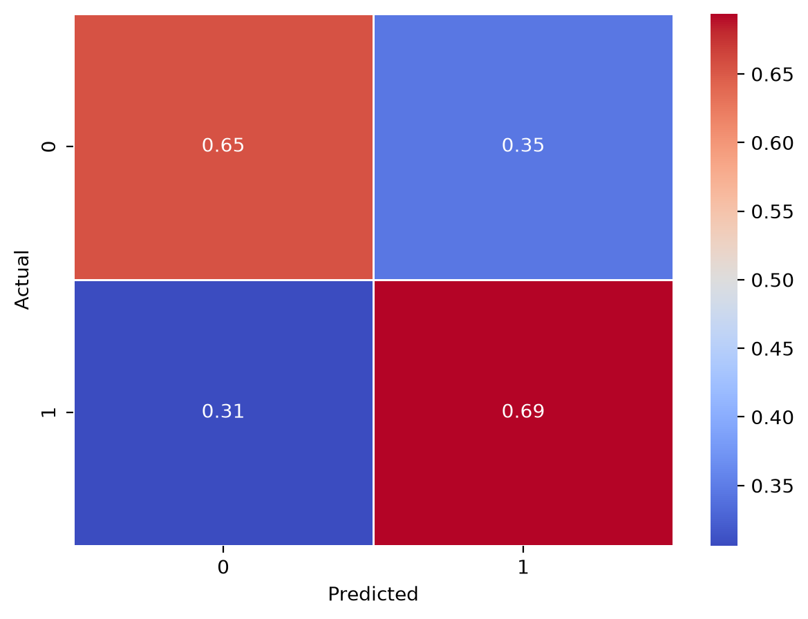
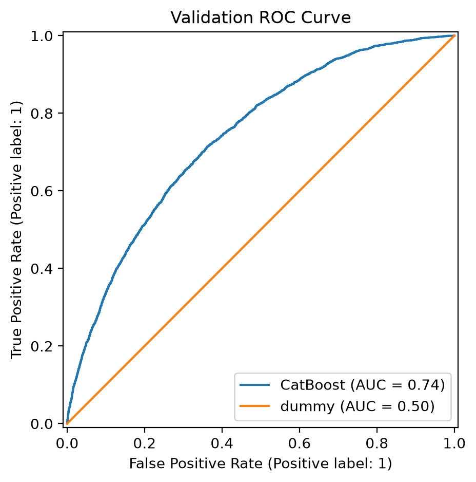
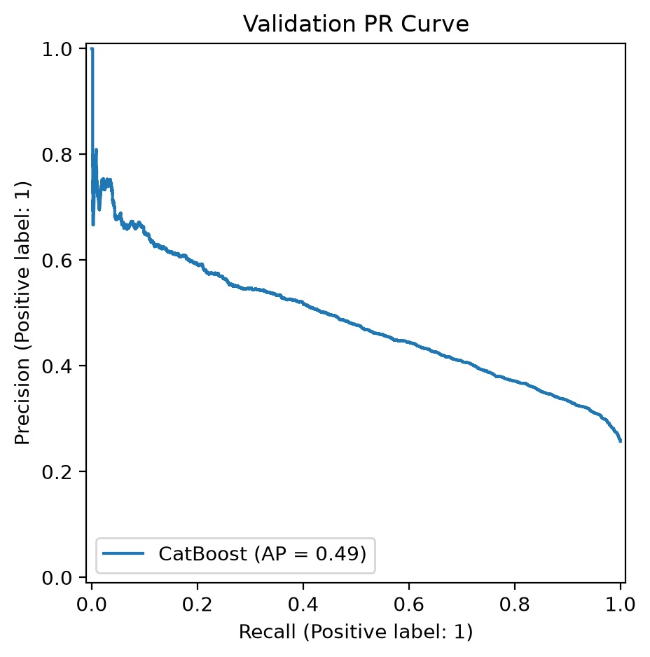
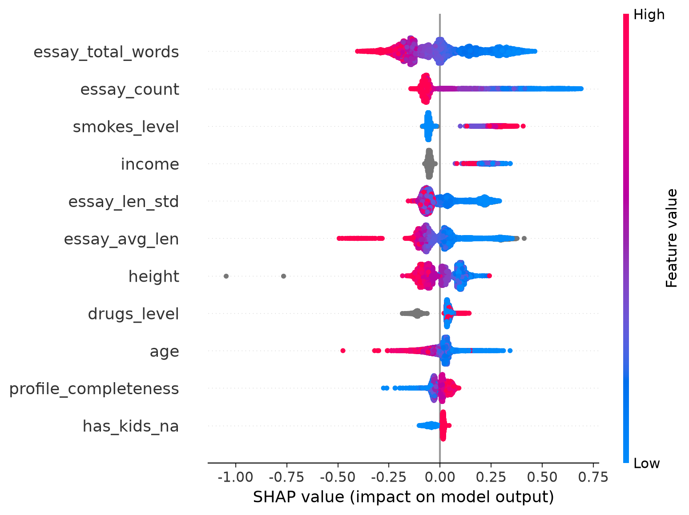
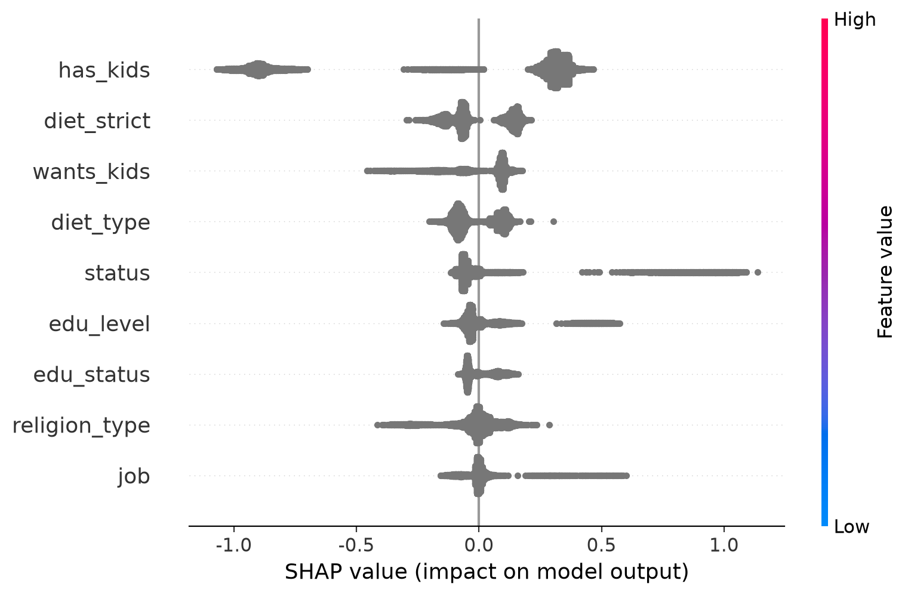

SK Networks Family AI Camp 36기

인공지능 학습 결과서

OkCupid Profiles 기반 이탈 의심 사용자 예측

| 작성자 | 김재훈 |
| --- | --- |
| 작성 일자 | 2026. 09. 26. |
| 데이터셋 | OkCupid Profiles Dataset (59,946명) |
| 타겟 | 이탈 의심 (churn_suspect) |
| 문제 유형 | Binary Classification |

## 1. 프로젝트 개요 및 모델링 목표

- 문제 유형: Binary Classification

- 데이터셋: OkCupid Profiles Dataset, 59,946행 × 원본 31개 컬럼

- Target: churn_suspect (기준 시각 2012-07-01 09:00 대비 30일 이상 미접속이면 1, 그 외는 0)

- Target 분포: 정상 44,527명(74.28%), 비활동 의심 15,419명(25.72%)

- 데이터 분할: 75:25 Stratified Split

- Primary Metric: PR-AUC(AP). 보조 지표로 ROC-AUC, Accuracy, Precision, Recall, F1-score를 함께 확인

| 원본 데이터에서는 탈퇴 여부를 알 수 있는 feature가 없기 때문에, last_online을 기준으로 churn_suspect를 생성하였다. Target 생성에 사용한 last_online은 학습시 데이터 누수의 위험이 있으므로 제거하였다. |
| --- |

## 2. 데이터 전처리 및 Feature Engineering

### 2.1 핵심 전처리

| 항목 | 처리 | 이유 |
| --- | --- | --- |
| 나이 | 18세 미만, 90세 초과 → NaN | 비현실적 이상치만 결측 처리 |
| 소득 | income이 -1 → NaN | -1은 실제 소득이 아닌 미공개 코드 |
| 범주형 결측 | not_disclosed (비공개) | 무응답 자체의 정보 보존 |
| 수치형 결측 | NaN 유지 | CatBoost가 수치형 결측을 직접 처리 |
| 중복 | 별도 제거 없음 | 원본 기준 0건 |
| Scaling | 미적용 | Boosting은 트리 기반 앙상블 모델 |
| Encoding | 미적용 | CatBoost가 범주형 변수를 직접 처리 |

### 2.2 파생 Feature

| 파생 Feature | 생성 방식 | 목적 |
| --- | --- | --- |
| drugs_level, smokes_level | 사용 빈도를 순서형 수치로 변환 | 빈도 순서를 모델에 반영 |
| diet_type, diet_strict | diet를 유형/준수 정도로 분리 | 복합 문자열 정보 분리 |
| edu_level, edu_status | education을 학력/진행 상태로 분리 | 학력 정보를 두 축으로 표현 |
| has_kids, wants_kids, has_kids_na | offspring에서 자녀 유무·계획·무응답 추출 | 자녀 관련 응답 패턴 분리 |
| religion_type | religion에서 종교 유형 추출 | 복합 응답 단순화 |
| profile_completeness | 프로필 17개 항목 응답 비율 | 프로필 참여 수준 수치화 |
| essay_count | 작성한 Essay 수 (0~10) | 자기소개 작성 범위 표현 |
| essay_total_words | 전체 Essay 단어 수 | 자기소개 전체 분량 표현 |
| essay_avg_len, essay_len_std | 작성 Essay 길이의 평균·표준편차 | 문항별 작성 밀도와 편차 표현 |

최종 모델 입력은 20개 Feature(범주형 9개, 수치형 11개)로 정리했다. 원본 essay0 ~ essay9 텍스트와 Target 생성에 사용한 last_online, 파생에 사용한 복합 원본 컬럼은 최종 입력에서 제외했다.

| 범주형 9개: job, status, religion_type, edu_level, edu_status, diet_type, diet_strict, has_kids, wants_kids 수치형 11개: age, height, income, drugs_level, smokes_level, has_kids_na, essay_count, profile_completeness, essay_total_words, essay_avg_len, essay_len_std |
| --- |

## 3. 모델 실험 및 비교

### 3.1 Baseline

초기 Baseline은 14개 Feature (last_online, speaks, essay0~9 제거, 나머지는 중앙값과 "unknown"으로 결측치만 제거)를 사용한 CatBoostClassifier(클래스 가중치 적용)로 설정했다. Recall은 0.69805로 양성 탐지 성향은 있었지만 Precision이 0.38647로 오탐이 많았다.

| Accuracy | Precision | Recall | F1 | ROC-AUC | Feature 수 |
| --- | --- | --- | --- | --- | --- |
| 0.63729 | 0.38647 | 0.69805 | 0.49750 | 0.72334 | 14 |

### 3.2 후보 모델 비교

후보 비교 단계에서는 첫 EDA를 거친 25개 Feature로 동일한 평가 분할을 사용했다.

| 모델 | Accuracy | Precision | Recall | F1 | ROC-AUC | 해석 |
| --- | --- | --- | --- | --- | --- | --- |
| Logistic Regression | 0.65350 | 0.39961 | 0.69079 | 0.50632 | 0.72869 | Recall 우수, 오탐 많음 |
| Random Forest | 0.71749 | 0.45748 | 0.52892 | 0.49062 | 0.73108 | Precision↑, Recall↓ |
| XGBoost | 0.67225 | 0.41602 | 0.67912 | 0.51596 | 0.74095 | AUC·F1 경쟁력 |
| LightGBM | 0.66818 | 0.41249 | 0.68353 | 0.51450 | 0.73965 | XGB와 유사 |
| CatBoost | 0.66838 | 0.41424 | 0.69857 | 0.52008 | 0.74146 | 후보 중 균형 우수 |
| MLP | 0.75746 | 0.58634 | 0.19377 | 0.29128 | 0.73028 | Accuracy 높지만 Recall 매우 낮음 |

| Accuracy와 Precision이 높은 Random Forest와 MLP은 중요한 지표인 Recall이 낮아 사용하기 어렵다. 이를 제외한 모델중 CatBoost가 균형있게 평가 지표 점수가 높기에 최종 모델로 선정했다. 물론 이후 최종 feature를 선정하고 hyper parameter를 조작할 때 다른 모델의 성능이 더 좋아질 수 있으나, CatBoost는 수치형 결측치를 자동으로 처리하고, 범주형 데이터에 강하기 때문에 선정했다. |
| --- |

## 4. Cross Validation 및 HPO

- 검증: 최종 Feature 20개, Train 44,959명 내부 Stratified 5-Fold (shuffle=True, random_state=42)

- 탐색: Random Search → 범위 축소 (Deep Random Search) → Bayesian Search

- 탐색 목표: PR-AUC(AP) 최대화.

- 최종 유지 파라미터: iterations=300, depth=5, learning_rate=0.06, auto_class_weights="Balanced", random_seed=42

| 후보 | 5-Fold AP | 5-Fold ROC-AUC | 결론 |
| --- | --- | --- | --- |
| Random Search | 0.49091 | 0.73703 | 최종 유지 |
| Deep Random Search | 0.48941 | 0.73618 | 개선 없음 |
| Bayesian Search | 0.49032 | 0.73670 | Recall↑, Precision↓ |

여러 차례 hyper parameter를 재조정하였으나, 처음 Random Search 후보를 안정적으로 넘지 못하였기 때문에, 기존 설정 (iterations=300, depth=5, learning_rate=0.06, auto_class_weights="Balanced") 로 유지했다.

## 5. 최종 모델 평가

최종 모델은 20개 Feature를 사용하는 CatBoostClassifier이다. 범주형 변수는 별도 One-Hot Encoding 없이 CatBoost의 범주형 처리 기능을 사용했으며, 수치형 결측은 NaN으로 유지했고, 범주형 결측은 not_disclosed로 처리했다. 클래스 불균형은 SMOTE 대신 auto_class_weights="Balanced" 로 보정했다.

| Train Acc. | Test Acc. | Precision | Recall | F1 | ROC-AUC | PR-AUC |
| --- | --- | --- | --- | --- | --- | --- |
| 0.67206 | 0.66471 | 0.41028 | 0.69390 | 0.51566 | 0.74005 | 0.48525 |

Feature Selection 과정에서 단순히 테스트 성능을 최대화하기보다, EDA를 통해 기존 변수와의 정보 중복을 고려해, 예측 근거가 상당히 부족한 변수 5개를 제거하였다.

| 제거한 Feature | 제거 근거 |
| --- | --- |
| actively_looking | 기존 status에서 계산할 수 있는 중복 정보 |
| has_essay0 | Essay 작성 여부가 essay_count와 중복되는 경향 |
| profile_completeness_group | 기존 profile_completeness를 구간화한 변수 |
| essay_almost_empty | Essay 작성량과 길이 관련 변수로 상당 부분 설명 가능 |
| essay_has_link | 추가했을 때 일관된 검증 성능 개선이 확인되지 않음 |

첫 EDA를 진행하여 후보로 선정한 Feature 25개로 CatBoost를 사용한것과 비교하면, 현재 모델의 테스트 성능이 소폭 하락하였다. (평균 0.0035)

다만 동일한 모델 조건 (hyper parameter) 으로 3-Fold 교차검증을 확인한 결과, PR-AUC는 소폭 (0.0003) 감소한 반면, F1-Score는 소폭 (0.0016) 상승하였다.

관측된 예측 성능의 변화가 작은 범위에서 중복 Feature를 제거하고, 모델의 입력 구조와 해석을 조금 더 단순화하였기에 최종 Feature 20개로 모델을 선정하였다.

| 지표 | Feature 25개 | Feature 20개 | 차이 |
| --- | --- | --- | --- |
| ROC-AUC | 0.73673 | 0.73664 | -0.00009 |
| PR-AUC (AP) | 0.48815 | 0.48784 | -0.00031 |
| F1-Score | 0.50979 | 0.51135 | +0.00156 |

모델의 성능이 크게 좋지 않은 이유는 이탈 의심자를 많이 탐지 (Recall) 하도록 학습하였으나, 그에 반하여 정상 사용자를 의심한 경우도 존재하기 때문이다. 다만 Threshold를 변경하는 경우 Precision은 올라가나 Recall이 감소하기 때문에 모델 성능 개선에 좋다고 생각할 수는 없다.

가장 직접적인 원인은 이탈 의심 여부를 예측할 직접적인 행동 데이터 (메시지 송수신 횟수, 매칭 빈도, 활동 시간, 탈퇴 여부, 사용한 총 요금 등) 가 부족하기 때문이다.

모델 성능을 더 높이는 것 또한 어느정도는 가능하나, 실질적으로 크게 개선되지는 못할 것이다. 실제로 HPO를 여러 차례 진행했지만 처음 잡았던 hp를 넘어서는 개선이 확인되지 않았으며, Feature Engineering을 추가로 진행하기에는 이미 충분히 진행하였기 때문이다. 물론 essay 쪽에서 못찾은 단서가 있어 평가 지표가 높아질 수 있으나, 오히려 Train과 Test 데이터에 대한 과적합이 생길 수 있으므로 모델 성능이 좋아졌다고 단정지을 수는 없다.

실질적인 모델 성능을 높이기 위해서는 행동 데이터가 필요하다고 생각한다.

### 5.1 Confusion Matrix

| 실제 \ 예측 | 정상(0) | 이탈 의심(1) |
| --- | --- | --- |
| 정상(0) | 7,287 (TN) | 3,845 (FP) |
| 이탈 의심(1) | 1,180 (FN) | 2,675 (TP) |

실제 비활동 의심자 3,855명 중 2,675명을 탐지했다. 반면 정상 사용자 11,132명 중 3,845명을 비활동 의심으로 분류해 Precision이 약 41% 수준에 머물렀다.

### 5.2 ROC / PR Curve

ROC-AUC는 0.74005, PR-AUC(AP)는 0.48525였다. 테스트 양성 비율 0.2572보다 AP가 높아 무작위 순위 모델보다 양성 클래스 식별력이 있음을 확인했다.

## 6. 모델 해석 (SHAP)

### 6-1. 수치형 Feature

- essay_total_words, essay_count, essay_len_std, essay_avg_len이 낮은 패턴은 비활동 의심 예측을 높이는 방향과 연결되었다.

- 의외의 결과로, EDA에서는 프로필 완성도가 높을수록 이탈 의심률이 낮았지만, SHAP 분석에서는 완성도가 높은 일부 사용자에게 이 변수가 이탈 의심 예측을 높이는 방향으로 기여했다. 이는 다른 변수들을 함께 고려한 모델의 예측 기여도이므로, 프로필 완성도가 이탈을 유발한다고 단정할 수는 없다.

- 수치형임에도 회색으로 표시된 것은 결측치이다.

- 범주형의 경우 정확한 해석은 어렵지만, 수치형 데이터보다 impact가 큰 feature가 존재한다.

- 자녀 여부, 엄격한 식단 등이 가장 모델 예측에 기여를 많이 하였다는 것을 알 수 있다.

- 다만 어떠한 응답이 영향력이 큰지 작은지는 EDA를 통해 확인하는 것이 적절하다.

| 순위 | Feature | 평균 \|SHAP\| |
| --- | --- | --- |
| 1 | has_kids | 0.466965 |
| 2 | essay_total_words | 0.149399 |
| 3 | diet_strict | 0.114385 |
| 4 | essay_count | 0.114320 |
| 10 | essay_len_std | 0.082276 |
| … | … | … |
| 18 | profile_completeness | 0.031477 |
| 19 | job | 0.027690 |
| 20 | has_kids_na | 0.026884 |

- 자기소개 작성 개수뿐 아니라, 단어 수, 평균 길이, 길이 편차가 의심 여부를 구분하는데 활용되었다.

| SHAP은 "모델이 어떤 Feature를 이용했는가"를 설명할 뿐, 해당 Feature가 실제 이탈의 원인임을 증명하지 않는다. 특히 자녀·종교 등 민감할 수 있는 정보는 실제 서비스 개입 기준으로 직접 사용하지 않는 것이 바람직하다. |
| --- |

## 7. 비즈니스 인사이트 및 활용 방향

- 이탈 의심이 된다/안된다 보다는, 이탈할 확률이 어느정도 인지 나타내는 것으로 활용했다. (60% 이상은 High, 40%~60%는 Medium, 그 이하는 Low로 추가로 보여주었다.)

- 프로필 완성이 부족한 사용자에게 자기소개 작성 안내나 가벼운 재방문 리마인드를 제공하는 실험을 설계할 수 있다.

- 운영 적용 시 이탈 점수 상위 사용자 전체에 동일한 혜택을 주기보다, Precision/Recall과 개입 비용을 고려해 임계값을 결정해야 한다.

- 유지 전략의 실제 효과는 모델 성능만으로 확인할 수 없으므로, A/B 테스트로 재방문률·프로필 완성률·알림 거부율 등을 비교해야 한다.

## 8. 한계 및 개선 방향

| 한계 | 개선 방향 |
| --- | --- |
| 실제 탈퇴가 아닌 30일 미접속 여부로 탈퇴를 판단 | 추후 로그인·매칭·메시지 등 시계열 행동 로그 확보가 된다면 미래 이탈 라벨 재정의 |
| OkCupid 단면 프로필 중심 데이터 | 최근 행동량·추천 노출·매칭·대화 성공률 등 서비스 행동 Feature 추가 |
| Precision 약 41%로 오탐이 많음 | 임계값 튜닝, 비용 기반 평가, PR-AUC/Precision 등 운영 지표 검토 |
| 기존 Test가 Feature 선택 과정에도 일부 활용됨 | 완전히 분리된 독립 Holdout 또는 시간 기반 검증 세트 확보 |
| 2012년 미국 OkCupid 데이터 | 현재 국내 데이팅 서비스에 적용할 경우 별도 재학습·검증 필요 |

## 9. 최종 요약

| 본 프로젝트는 OkCupid Profiles 59,946명을 대상으로 `last_online`을 이용해 30일 이상 미접속 사용자를 비활동 의심자로 정의하고, 프로필 응답·자기소개 작성 수준을 중심으로 이진 분류 모델을 구축했다. 최종적으로 20개 Feature를 사용하는 CatBoostClassifier를 선택했으며, Random Search와 Bayesian Search 이후에도 기존 설정(`iterations=300`, `depth=5`, `learning_rate=0.06`, `auto_class_weights="Balanced"`)이 가장 안정적인 후보로 유지되었다. 최종 Test에서 Recall 0.69390, ROC-AUC 0.74005, PR-AUC 0.48525를 기록해 비활동 의심 사용자 약 69.39%를 탐지했다. SHAP 분석에서는 `has_kids`, `essay_total_words`, `diet_strict`, `essay_count`, `wants_kids`가 상위 예측 Feature로 나타났다. 다만 실제 탈퇴가 아닌 대리 라벨이며 행동 로그가 부족하므로, 결과는 "이탈 원인"이 아니라 2012년 OkCupid 데이터에서 관찰된 비활동 의심 패턴으로 해석해야 한다. |
| --- |

